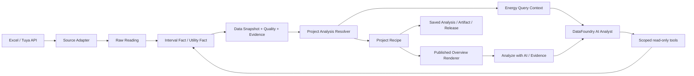

# EnergyIQ 交接手册：架构、任务路径与本地部署

本文是交接导航，不替代 GitHub Issue 的验收标准，也不把历史 Runlog 当成当前实现状态。交接时以“当前确认的代码 head + GitHub ticket + 可复现测试证据”为准。

## 0. 2026-08-27 交接状态快照

这是本轮收尾的单一状态入口；使用前仍须执行 `git fetch origin --prune` 与 `git ls-remote` 防止 SHA 漂移。

| 对象 | 交接时 exact 状态 | 已确认边界 |
| --- | --- | --- |
| `origin/main` | `752e09ed0836cdec07f6e2dda0108414aa8bb72c` | 稳定代码线；最新合并 PR #120 只是隔离 pi-ai Model Gateway evaluation，不代表生产 adapter、Runtime 切换、真实 Provider 验收或 #105 授权 |
| `origin/dev` | `a437c07f6186337600c999503230586de805dc96` | 测试候选线；已含 PR #179 DPL-03、PR #187 AI evidence-first 与 PR #192 Holiday-only replacement |
| 香港测试服务器 | 当前仍为 `e825ae7b6a11088d9342ec2b1e8f1e6eeb181f39` | API/Web/nginx 与内外健康检查正常；`dev@a437c07f` **尚未部署** |
| 生产服务器 | 本次收尾未执行部署或写操作 | 不得用 `main` 分支名推断实际生产 Release；任何动作前重新核对 physical `current`、manifest、BUILD_ID、备份与健康状态 |

### 已合并或关闭

- PR #192 已经双轴复审并合入 `dev@a437c07f`：Ngee Ann Holiday 第五 Section、旧 Release 四 Section、Saved Analysis compatibility 与 current exact `@3` dynamic headline 均保留；没有生产/Provider/浏览器验收声明。
- PR #190 已合入 `main`：只记录受保护模型请求 Payload 的 proposed design；Issue #102 保持 open，#105 继续冻结。
- PR #120 已合入 `main@752e09ed`：完成隔离 pi-ai Model Gateway evaluation；候选依赖不进入生产安装图、Providers public seam 或 Runtime，不能据此宣称 production adapter 已完成。
- 旧 PR #166、#128 已因 replacement 合并而关闭，禁止整支复活或合并。
- PR #191 已在最新 `dev` 上形成 remote checkpoint：base/merge-base `a437c07f`，head `7e4add26fbbb21fba92aedc64cfef5d9e0711a6c`；本地 evaluation 53/53、Providers 27/27、cold 3×3、typecheck/build/docs/diff 和 fresh CI 已通过，post-Holiday EnergyIQ seams 与独立 exact-head review 仍是合并门。它只是隔离 evaluation，不是生产 Model Gateway/Runtime/Provider adapter，也不解锁 #105。
- Draft PR #193 是 #161 Accepted Finding Phase A 的可恢复 WIP checkpoint：base/merge-base `dev@a437c07f`，head `a91b13aaff998edf653c943ed96b48c22383613c`；focused 2 files/20 tests、root build、docs/diff 和 fresh CI 已通过，8 files/96、显式 Contracts/API builds、EnergyIQ seams 与独立复审仍未完成。不得在这些门完成前合并或启动 #162/#135。
- PR #194 是香港测试服务器的 docs-only 事故/部署交接：remote head `9736bdf6dfecafb531770afccd90d5b24e87a664`，包含 retained lock/staging 的 fail-closed 恢复门、DPL-03 exact Node/layer 约束和测试数据/备份未知项；它不代表候选已经部署。
- Draft PR #195 是 #172 Managed Overview materialization 的安全 WIP checkpoint：remote head `0ebefddc2d33d609a3764980b7a70ae7a74b8ab7`，17 个 owned files，focused 7 files/87 tests、API build、docs/diff 通过；但分支落后 `origin/main` 30 commits，PR 当前 `CONFLICTING/DIRTY`。它只用于恢复工作，必须在 clean latest baseline 上选择性 replay、解决冲突并完成双轴复审/完整 seams/CI，禁止直接合并。

### 测试服务器当前 blocker

测试服务器的上一轮中断部署留下 `/opt/energyiq-datafoundry/.deploy.lock` 和目标 `.staging-e5533ac9…`。锁内 PID 已不存在，`current` 仍安全指向健康的 `e825ae7b…`；但 Runbook 要求 fail closed，不能直接删除锁或 staging。交接人必须先按[生产不可变 Release 部署与回滚 Runbook](../plans/2026-08-18-生产不可变Release部署与回滚Runbook.md)完成一次“中断部署事故恢复”审计，再部署唯一候选 `dev@a437c07f`。同时先确认测试专用 Shared Storage、备份 checksum 与隔离恢复证据；不得从生产环境复制数据来补证。

### 下一位交接人的执行顺序

1. **恢复测试服务器部署现场**：先读 [PR #194](https://github.com/Zion74/energyiq-datafoundry/pull/194) 及其新增的测试服务器交接记录；核对 `current=e825ae7b…`、残留 PID 不存在、服务健康、锁/staging 精确归属；经负责人授权后归档事故证据并释放现场，不得猜测性删除。
2. **部署并验收 `dev@a437c07f`**：使用 Node `v22.23.2` 和 DPL-03 lock-hash layer，必须命中现有 ready layer、`npm ci=0`；记录 Artifact SHA256、Release identity、回滚点。验收 login、多账户、三项目切换、Overview minimum/full、Holiday dynamic headline、AI Analysis direct/top-nav exact window、旧 Saved read-only、普通 GET 0 Provider/0 mutation。
3. **完成 #172 不可变 Managed Overview Projection**：从 [Draft PR #195](https://github.com/Zion74/energyiq-datafoundry/pull/195) 的 `0ebefddc…` 只读恢复 17-file WIP，在负责人固定的 latest baseline 上选择性 replay，不能整支 merge；新 Snapshot/Release/Report-time/revision 身份变化时物化一次，普通 Overview 与 AI Analysis 读取已验证的 immutable `OverviewContextPackage`，无身份变化严格不重算。禁止创建第二套计算/Store，也禁止放宽 timeout。
4. **独立修复 #168 DuckDB cleanup / SQL_TIMEOUT**：证明 retained resource 并做有界清理；不要和 #172 混成一个大 PR。
5. **Harness 严格串行**：从 `dev@a437c07f` replay #161 五文件 Phase A；通过后才做 #162 四个 Web 文件；最后做 #135，并证明 direct/top-nav 普通 AI Analysis 不隐式加载 Skill。#105 始终冻结，除非负责人重新显式授权。
6. **收口 #191**：补 post-Holiday EnergyIQ seams，重新做 exact-head review 后才能考虑合入 `dev`；不得把 evaluation 晋升为 production adapter。
7. **其余独立工作**：#174 generic Session lifecycle、#189 legacy docs 资产盘点、Tuya Office Overview 产品结构，均不得阻塞上述测试部署与 #172 主线。

### 当前不能宣称完成的事项

- `dev@a437c07f` 尚未部署到测试服务器，因而没有该 exact Release 的浏览器、多账户或真实 AI Trace 验收。
- AI Analyst 已有 Preparing 观测和 evidence-first 行为，但 #172 尚未完成，所以首答前仍可能执行完整 ProjectAnalysis；#168 仍可能导致 DuckDB/SQL timeout。
- #191、#193（#161 replacement）均只是远端候选/checkpoint；没有合并、部署或 Provider 证据。PR #194 也只是事故/部署交接文档，不是服务器变更证据。
- PR #195 只是可恢复的 #172 WIP，而且当前冲突；focused tests 不能替代 clean replay、完整测试、review 或部署。
- 生产未更新；交接文档、PR 合并和 CI green 都不能替代生产发布证据。

### 本地残留的处置边界

本轮没有把“所有能看到的文件”机械地提交。`energyiq-datafoundry-worker-3` 的大批跟踪删除、Integration/Tuya/旧 worker 目录中的 `.scratch`、`outputs`、SQLite/DuckDB、acceptance artifacts 与其他生成物，均因 owner/来源/可恢复性不清而保留原位；它们不是交付物，也不得整包 add/commit。Integration 中旧的 `2026-08-23-Tuya-Office-API-Scene-Handoff.md` 仍是针对 `codex/integration-20260818@760a24d0` 的历史本地交接，当前远端权威入口是已分类的 Tuya Source Connector 运行手册、Tuya Overview Runlog 与本手册；下一位如需保留旧文，只能先做逐节去重、修复分类路径和敏感资料引用，再单独提 docs PR。

## 1. 先给交接人的一句话

EnergyIQ 是一个面向能源运营决策的系统：

- **确定性 Overview** 负责让 Boss/FM 打开页面就看到本期最重要的问题、影响、证据和行动方向；
- **AI Energy Analyst** 负责在同一个可信 Project、Scope、Period 和 Snapshot 内继续查数、解释和追问；
- 两者共用同一套能源事实和 Evidence，但 AI 不拥有官方 KPI，也不负责生成 Overview 的权威指标。

它不是通用 BI 看板，也不是让模型直接生成 SQL/React 页面。核心原则是：**数据事实和确定性计算先固定，模型只在服务端授权的范围内做受控分析和表达。**

## 2. 项目整体构思



### 每一层做什么

| 层 | 责任 | 不应该做什么 | 主要代码入口 |
| --- | --- | --- | --- |
| Energy Data Foundation | 把 Excel/API 统一成 Raw Reading、Interval Fact、Utility Fact、质量事件和 Data Snapshot | 不在页面或 Prompt 中临时计算官方指标 | `apps/api/src/energy/energy-excel-import.ts`、`energy-import-materializer.ts`、`packages/metadata/src/energyiq-store.ts` |
| Project Analysis | 根据已登录身份、Project、Scope、Primary Period 和 Published Release 解析可信分析上下文，执行确定性 Recipe | 不接受浏览器直接提交的 Snapshot/Release 作为权威身份 | `apps/api/src/energy/project-analysis-resolver.ts`、`energy-analysis.ts`、`energy-query-context.ts` |
| Project Renderer | 把 Project Analysis Snapshot 渲染成 Ngee Ann、Preschool 或其他项目的 Overview | 不直接查 DuckDB、不重新计算 KPI、不发明事实 | `apps/web/src/app/energyiq/_components/energy-template-renderer.tsx`、各项目 renderer |
| DataFoundry Runtime | 提供 Provider、Session、Run、Trace、Task Console、Tools、Knowledge、MCP、Skills 和流式执行 | 不接管 EnergyIQ 的官方 KPI、Overview 视觉和数据真相 | `packages/agent-runtime/`、`packages/providers/`、`apps/api/src/server.ts` |
| Metadata / Storage | 保存用户、Workspace、Project、Mapping、Release、Template、Snapshot、Saved Analysis 和审计记录 | 不把历史 Saved Analysis 静默改成当前结果 | `packages/metadata/`、`storage/` |

### 技术路线的核心取舍

1. **继续在 DataFoundry 内二次开发**，复用已有登录、Session、Provider、Agent、审计和工作台能力。
2. **能源事实层与 Overview 是 EnergyIQ 自己的产品真相**，不能被通用 Agent Runtime 反向定义。
3. **Overview 优先确定性、可复跑、可降级**；模型不可用时，数字、图表、质量和官方 Findings 仍然可用。
4. **AI 通过显式 Energy Query Context 进入系统**，模型只能在服务端解析后的 Project 范围内使用受控只读工具。
5. **Excel 和 Tuya API 只是不同 Source Adapter**；后面的 Fact、Recipe、Renderer 和 AI Context 不应依赖具体来源。
6. **版本和证据是产品能力**：Data Snapshot、Metric/Rule、Template/Renderer、Project Release、Analysis Run 和 Evidence 必须能解释一次结果从哪里来。

## 3. 技术栈和代码地图

### 技术栈

| 领域 | 当前技术 |
| --- | --- |
| 运行时 | Node.js 22+、npm workspaces |
| 语言 | TypeScript，ES modules |
| Web | Next.js 15、React 19、Tailwind CSS 4、Recharts |
| API | Node/TypeScript API，工作区包通过 npm workspace 组合 |
| Agent | Mastra、AG-UI、CopilotKit runtime、AI SDK |
| Provider | OpenAI-compatible、DeepSeek、Alibaba/Qwen 等适配器 |
| 数据访问 | Data Gateway；包含 DuckDB、PostgreSQL、MySQL 等 Connector |
| 持久化 | SQLite Metadata、DuckDB Energy Fact/分析数据、文件 Storage |
| 测试 | Vitest、TypeScript build、EnergyIQ 三条高层测试 Seam |

### 新人先看哪些目录

```text
apps/api/src/energy/                    EnergyIQ 领域服务、解析、导入、API 合同
apps/web/src/app/energyiq/               Overview、Explorer、AI、Admin 页面和组件
packages/contracts/                      跨包共享类型和事件合同
packages/metadata/                       SQLite 元数据、Project/Release/Snapshot/Saved 存储
packages/data-gateway/                   DuckDB 与外部数据源的受控访问
packages/agent-runtime/                  Agent、Session、Context、Tool、Trace 运行时
packages/providers/                      模型 Provider 适配
scripts/energyiq/                        EnergyIQ 重启、发布、备份和验证脚本
docs/energyiq/                           产品决策、领域模型、实施记录和交接材料
docs/agents/                             Issue、领域、Worktree 和测试基线
```

建议第一次小调整从一个纵向切片开始，例如：

1. 先找到对应页面入口 `apps/web/src/app/energyiq/<surface>/page.tsx`；
2. 再追它调用的 API/读取模型；
3. 再追 `apps/api/src/energy/` 中的确定性计算或 Context Resolver；
4. 最后补同目录或相邻的 focused test；
5. 不要先改通用 Agent Prompt 来“修正”官方 EnergyIQ 数值。

## 4. 任务路径：从哪里开始、按什么顺序读

### 4.1 第一轮只读阅读顺序

1. 仓库根目录的 `CONTEXT.md`：确认仓库入口。
2. [领域词汇表](../CONTEXT.md)：确认 Project、Workspace、Tier、Meter、Fact、Snapshot、Release、Run、Evidence 等名称。
3. [当前共识与新会话入口](../decisions/当前共识与新会话入口.md)：看当前产品边界、已确认决策、现状和待补项。
4. [阶段技术选型](../decisions/阶段技术选型-基于DataFoundry二次开发.md)：理解为什么复用 DataFoundry、为什么不在 MVP 引入 Superset/Rill。
5. [Overview 与 AI 的最终方案](../decisions/决策-Overview改造与AI-Analysis打通最终方案.md)：理解四层架构和 AI 的边界。
6. [执行基线](../../agents/energyiq-execution-baseline.md)：理解 Integration/Worker Worktree、三条测试 Seam 和端口归属。
7. 最后才读与当前 ticket 直接相关的实施记录；带日期的 Runlog 不是默认现状，必须和当前代码、测试一起核对。

### 4.2 GitHub Issue 的阅读路径

GitHub Issues 是任务、规格和验收标准的权威来源。不要按编号从小到大通读，按下面的关系读：

```text
产品地图 #1
  ├─ Overview / AI 总体地图：#48、#54、#62
  ├─ Overview / 时间 / Snapshot：#75、#80、#81、#83、#130–#134、#151、#154、#163、#172–#173
  ├─ AI Analyst / 质量 / 复跑：#30、#35、#36、#39、#43–#47、#56、#57、#60、#90、#100、#141–#142、#158
  ├─ Admin / Harness / 治理：#61–#66、#102、#114、#117、#122–#127
  └─ 工程交付 / 运行：#92、#96、#150、#168、#174
```

每个 ticket 开始前，交接人至少确认：

- ticket 是否仍然 open、是否有 `ready-for-agent` 或 `ready-for-human`；
- 当前 reviewed head、分支和 owned paths；
- Acceptance、Forbidden paths、Required tests；
- 这是本地/集成测试，还是还要求真实 Provider、浏览器、部署或人工产品验收；
- 完成后把 evidence 回写 ticket，不能只说“代码已改”。

### 4.3 推荐实现顺序

如果需要解释“接下来怎么做”，可以按这条主线说：

1. **先守住运行和事实边界**：能构建、能启动、Snapshot/Release/Scope 不漂移，三条 Seam 有基线。
2. **再补数据和确定性分析**：Source Adapter → Fact → Snapshot → Project Analysis Resolver → Recipe。
3. **再做项目页面和交互**：Renderer 只消费 Analysis Snapshot，Overview/Explorer 的数字不能从前端另算。
4. **再接 AI**：Energy Query Context → scoped read-only tools → Finding/Evidence → AI Slot/AI Analyst。
5. **再做 Admin 和治理**：Mapping、Metric/Rule、Template、Release、Model/Skill/Tool/Context 配置和审计。
6. **最后做真实质量和交付门**：focused tests、Seam、build、真实 Provider、生产浏览器、多账户、部署和人工价值验收分开记录。

### 4.4 分支、服务器和本地 Worktree 怎么对应

先记住一个简单规则：**测试服务器跟 `dev`，生产服务器跟 `main`，日常开发跟 `codex/<ticket>-<slug>`。**分支名不能单独证明代码已经部署；部署前还要核对服务器实际 checkout 的 SHA、进程命令行和健康检查。

以下是 2026-08-26 收口时的审计快照；分支 SHA 会继续前移，使用前应重新执行 `git fetch` 和 `git ls-remote` 核验：

| 分支/对象 | 用途 | 是否直接对应服务器 | 交接人怎么使用 |
| --- | --- | --- | --- |
| `main` / `origin/main` | 稳定发布和生产基线 | 生产服务器 | 当前交接 exact 为 `752e09ed`；只通过 PR 合并，不要直接在服务器改代码或直接 push；分支 SHA 不等于实际生产 Release |
| `dev` / `origin/dev` | 测试服务器的持续集成基线 | 测试服务器 | exact 为 `a437c07f`，已包含 PR #179 DPL-03、PR #187 AI evidence-first 与 PR #192 Holiday-only replacement；香港测试服务器仍运行 `e825ae7b`，部署被 retained lock/staging 阻断 |
| `codex/<ticket>-<slug>` | 一张 ticket 的开发分支 | 不直接部署 | 从负责人确认的 reviewed head 创建，使用独立 Worktree，完成后提 PR 到 `dev` |
| `codex/integration-20260818` | 当前已有的本地 Integration 集成线 | 仅本地长期集成环境 | 对应 `D:\Projects\energyiq-datafoundry-integration`；只有这里运行长期 Web/API/DuckDB，不等同于 `dev` 或 `main` |
| `codex/night-*`、`codex/release-*` 及其他旧分支 | 夜间执行、发布或历史 ticket 的专用分支 | 以各自 Runlog 为准 | 不要仅凭分支名继续开发；先查 owner、HEAD、Worktree 和状态 |

旧源目录曾停在 `main@ccff860b`，含 175 项工作区变化并落后远端 217 个提交。该状态已非破坏性收口：文档资产保存在 `codex/legacy-main-docs-preservation-20260825@dfa6f565`，生成物移入带 SHA-256 清单的本地归档，跟踪 ticket 为 #189；本地 `main` 已恢复到远端稳定线。保全分支不是合并候选，不能整包 merge。Integration Worktree 的 `codex/integration-20260818@760a24d0` 也不是服务器分支。

#### 目标协作流程

```text
codex/<ticket>  →  Pull Request  →  dev  →  测试服务器
                                      ↓ 验收通过
                                   Pull Request
                                      ↓
                                    main  →  生产服务器
```

交接人日常只需要记住以下操作：

```powershell
# 核验远端 dev 与 main 的 exact SHA；不要只看分支名
git fetch origin --prune
git branch -r

# 第一次建立本地 dev 跟踪分支
git switch --track origin/dev
git pull --ff-only origin dev

# 开始一张 ticket：不要直接在 dev 上改
git switch -c codex/<ticket>-<slug> origin/dev

# 完成后推送自己的分支，发 PR 合并到 dev
git push -u origin codex/<ticket>-<slug>
```

`dev` 已由负责人从干净的 reviewed `main` 创建，不能用旧保全分支或 `codex/integration-20260818` 重建或覆盖。测试服务器部署时仍须记录实际 `dev` SHA、不可变 Artifact 哈希、DPL-03 dependency layer hit/miss、服务进程和健康检查；分支或已合并 PR 本身不等于已经部署。

#### 当前任务与 Session 导航

GitHub Issue/PR 是可交接的权威任务状态；Codex Session 只用于找到仍在运行的上下文，不能替代提交、CI 或部署证据。

| 角色 | Session | 当前职责 |
| --- | --- | --- |
| 主 Agent | `codex://threads/019ff091-092f-7e42-8147-ff4c0c19b332` | 合并决策、`dev`/`main` 边界、最终交接与验收判断 |
| 测试服务器 | `codex://threads/01a036bc-996a-7601-9196-a9d7dd9cb8e3` | 香港测试服务器恢复、exact `dev` 部署、DPL-03 与真实 AI Analysis 验收 |
| 文档整理 | `codex://threads/01a036ee-cdc3-7763-932f-3e19b3c054ff` | `docs/energyiq` 分类、链接修复和交接材料维护；实现已交由 PR 记录 |
| Harness Evolution | `codex://threads/01a00541-f7eb-7b03-a74f-43e1f5dff6f3` | 历史 Harness/Accepted Finding 工作；继续前先核对 GitHub 当前 Issue/PR 状态 |
| Tuya / 历史复审 | `codex://threads/01a01f3b-02c7-73e1-b41d-be5fcd8072bb` | Tuya 及历史 PR 复审上下文；不是当前部署 Owner |
| Backup / PR #153 历史工作 | `codex://threads/01a03327-dd45-7c11-a845-152420bf61de` | Shared Storage backup 历史实现证据；当前状态以 #150 及后续 PR 为准 |

## 5. 本地部署：交接人自己的干净环境

### 5.1 推荐方式

交接人应从已确认的 reviewed head 重新 clone 或创建自己的 clean Worktree，不要复用旧保全分支或长期 Integration Worktree。交接会议上先用 `git ls-remote` 确认当时的 `origin/main` / `origin/dev` exact SHA，再给对方命令；文档中的 SHA 是审计快照，不是永久常量。

Windows PowerShell 示例：

```powershell
git clone https://github.com/Zion74/energyiq-datafoundry.git energyiq-datafoundry-handoff
Set-Location .\energyiq-datafoundry-handoff
git switch --detach <reviewed-head>

node -v        # 需要 Node.js >= 22
npm ci
Copy-Item .env.example .env
Copy-Item apps/web/.env.example apps/web/.env.local
```

### 5.2 最小本地环境

根目录 `.env` 至少需要这些类别；值由交接人自己填写，不要把真实值写入文档：

```dotenv
API_HOST=127.0.0.1
API_PORT=8787

LLM_PROVIDER=openai-compatible
LLM_MODEL=<test-model>
LLM_BASE_URL=<openai-compatible-endpoint>
LLM_API_KEY=<test-key>

STORAGE_ROOT_DIR=storage
METADATA_DB_PATH=storage/metadata/workbench.sqlite
SECRET_MASTER_KEY=<new-random-local-key>

DATAFOUNDRY_AUTH_MODE=password
AUTH_SESSION_SECRET=<new-random-local-secret>
AUTH_PUBLIC_BASE_URL=http://127.0.0.1:3000
AUTH_EMAIL_DELIVERY=test
ENERGYIQ_ADMIN_EMAILS=<交接人的测试管理员邮箱>
```

`apps/web/.env.local` 使用正式测试的同源 BFF 配置：

```dotenv
NEXT_PUBLIC_DATAFOUNDRY_AUTH_MODE=password
NEXT_PUBLIC_AGENT_RUNTIME_URL=
NEXT_PUBLIC_CONFIG_API_URL=
API_PROXY_TARGET=http://127.0.0.1:8787
```

如果只是做页面小调整，通常不需要 Tuya 访问密钥、真实 SMTP、真实生产 Storage 或真实生产数据库。只有要复现 Tuya 数据同步时，才在单独的测试环境配置 `ENERGYIQ_TUYA_ACCESS_ID`、`ENERGYIQ_TUYA_ACCESS_SECRET` 和 endpoint。

### 5.3 正式测试启动

正式测试使用 `password + build/start`，不要把 `npm run dev` 当成最终验收证据：

```powershell
npm run build
npm run build:web
npm run start:api    # API: 127.0.0.1:8787
npm run start:web    # Web: 127.0.0.1:3000
```

另开 PowerShell 检查：

```powershell
Invoke-WebRequest http://127.0.0.1:8787/healthz
Invoke-WebRequest http://127.0.0.1:8787/ready
```

然后打开：

- 登录：`http://127.0.0.1:3000/login`
- 通用 Data Tasks：`http://127.0.0.1:3000/data-tasks`
- EnergyIQ Overview：`http://127.0.0.1:3000/energyiq/overview`

`AUTH_EMAIL_DELIVERY=test` 时，注册/重置链接会打印在 API 控制台，不会真的发送邮件。

### 5.4 改动后的最低验证

```powershell
npm run build
npm run test:energyiq:seams
```

EnergyIQ 三条高层 Seam 分别保护 Project Analysis Resolver、Project Renderer Registry 和 Energy Analyst。ticket 若要求 Web 全量、真实 Provider、浏览器、多账户或部署验收，要单独执行并单独报告，不能用 build 或 smoke 替代。

### 5.5 现有 Integration 环境的使用边界

长期 API/Web/DuckDB 环境只由 `D:\Projects\energyiq-datafoundry-integration` 持有。使用前先核对其 branch、head 和工作树归属；不要从源目录或 Worker Worktree 启动共享服务。受控重启命令是：

```powershell
Set-Location D:\Projects\energyiq-datafoundry-integration
.\scripts\energyiq\restart-overview.ps1 -PreflightOnly
.\scripts\energyiq\restart-overview.ps1
```

该脚本会验证进程命令行确实属于 Integration Worktree，只输出 `secretMasterKeyConfigured: true/false`，不会打印密钥。

## 6. `.env` 能不能直接发给交接人？

**技术上可以，交付上不建议直接发原始 `.env`。**“现在是测试环境”只能降低影响范围，不能消除风险。当前 `.env` 中已经存在以下类型的敏感配置：

- `SECRET_MASTER_KEY`：可能决定已有 Metadata/模型配置能否解密；
- `AUTH_SESSION_SECRET`：影响登录 Session；
- Tuya Access ID/Secret：可能直接访问外部能源数据；
- 还可能包含模型 API Key、SMTP 密码、数据库或文件存储路径。

建议采用下面的交接方式：

1. 发送 `.env.example` 和上面的最小配置模板；
2. 对**全新本地环境/全新空 Store**，交接人自己生成新的 `AUTH_SESSION_SECRET`、`SECRET_MASTER_KEY`，并使用自己的低额度测试模型 Key；接手现有服务器和已有加密 Metadata 时不得直接替换 `SECRET_MASTER_KEY`，否则历史加密配置可能无法解密；
3. 只有确实要复现现有加密配置或既有测试数据时，才单独交付对应的测试 Storage 和同一 `SECRET_MASTER_KEY`；
4. Tuya/模型密钥通过一对一、可撤回的方式传递，不放进 Git、Issue、群聊或交接文档；
5. 交接完成后撤销或轮换旧的模型/Tuya/SMTP 密钥，并让交接人确认本地已切换到自己的凭据。

不要直接发送完整 `.env`，也不要发送个人 SSH 私钥。交接所需的单项 secret 只能经组织批准的密码库或点对点加密通道传递；服务器访问使用实名账号和交接人的独立公钥。交接结束后按权限清单撤销临时访问并轮换应轮换的外部密钥。

### 6.1 服务器权限怎么交接

服务器地址、用途、当前 Release、端口/服务、Runbook、回滚点和 blocker 属于**非 secret 运维清单**，统一从 [PR #194](https://github.com/Zion74/energyiq-datafoundry/pull/194) 的测试服务器交接记录读取；使用前仍要在阿里云控制台和服务器上重新核验。不要把密码、Private Key、Cookie、token 或 EnvironmentFile 内容写进该清单。

SSH 推荐按人员建立独立身份，而不是发送现有操作者的私钥：

1. 交接人本机生成自己的带口令 SSH key pair，只把 `.pub` 公钥交给现有 operator；私钥始终留在交接人自己的设备或受控密码库中；
2. 现有 operator 在服务器为交接人建立/确认具名账号，并把该公钥追加到该账号的 `authorized_keys`；不要在演示或发布前用“替换 key”覆盖现有入口；
3. 先在独立终端验证新账号可登录、只拥有所需 sudo/文件权限、能只读核对 systemd/Release/health；旧入口暂时保留作为回退；
4. 交接确认后撤销不再需要的旧公钥和阿里云 RAM/Workbench 权限，并记录 owner、添加时间、撤销时间；不要共享阿里云主账号；
5. 如果当前只有一份历史共享私钥，把它视为待淘汰凭据：只用于恢复访问，随后立即迁移到每人独立公钥并轮换共享 key，不能把共享私钥当成长期交付物。

现有服务器上的 EnvironmentFile 应继续留在服务器受保护路径，由服务器账号和 sudo 权限控制；交接人通常不需要把它复制到个人电脑。交接时交付的是“配置项名称、用途、owner、所在环境、轮换方式和 present/missing 状态”，不是明文值。只有必须迁移到另一台主机时，才通过组织批准的加密密码库/点对点加密通道传递对应 secret，并在迁移验收后轮换；测试和生产的 secret、数据与 SSH 权限必须完全分开。

## 7. 下午会议建议讲法（20–30 分钟）

1. **产品目标，3 分钟**：EnergyIQ 解决的是“本期哪里有问题、为什么、下一步做什么”，不是单纯展示图表。
2. **架构，8 分钟**：沿着 Excel/Tuya → Fact/Snapshot → Resolver/Recipe → Overview，以及 Context → AI Analyst 讲一遍；强调 DataFoundry 只承载 AI Runtime。
3. **分支和服务器，4 分钟**：说明 `main`=生产代码线、`dev`=测试候选线、`codex/<ticket>`=个人开发；明确交接快照为 `main@752e09ed`、`dev@a437c07f`，香港测试服务器仍是 `e825ae7b`，Integration 不是服务器分支，且分支 SHA 不等于部署 SHA。
4. **代码，5 分钟**：展示 `apps/api/src/energy`、`apps/web/src/app/energyiq`、`packages/metadata`、`packages/data-gateway`、`packages/agent-runtime` 五个入口。
5. **任务，5 分钟**：从 GitHub #1 的地图进入对应子地图，再进入一个 `ready-for-agent` ticket；说明 Acceptance、Forbidden paths 和证据边界。
6. **上手，5 分钟**：让对方在自己的 clean Worktree 完成安装、配置、启动、`/healthz`、`/ready`，再做一个小改动跑 `npm run build` 和聚焦测试。
7. **最后确认**：对方能说清楚“一个页面数字从哪来”“一个 AI 问题能访问什么”“改动后先跑什么测试”“哪些密钥不能进仓库”“测试和生产分别跟哪个分支”。

## 8. 交接完成判据

- [ ] 对方拿到 reviewed head、GitHub 仓库和当前 ticket 路径。
- [ ] 对方能说清楚 `main`、`dev`、`codex/<ticket>` 和 Integration Worktree 的边界；测试服务器只跟踪 `dev`，生产只跟踪 `main`，并能核对两端实际部署 SHA。
- [ ] 对方读完领域词汇表、当前共识、阶段技术选型和最终架构方案。
- [ ] 对方能在自己的 Worktree 安装并启动 API/Web。
- [ ] `/healthz` 和 `/ready` 均通过，能打开登录页和 EnergyIQ 页面。
- [ ] 对方能定位一次从页面到 API/Resolver/Fact 的调用链。
- [ ] 对方完成一个小调整，并跑过对应 focused test、`npm run build` 或 ticket 要求的测试。
- [ ] 本地凭据与共享测试凭据边界已确认；没有把原始 `.env`、生产 Storage 或真实外部密钥提交到仓库。

