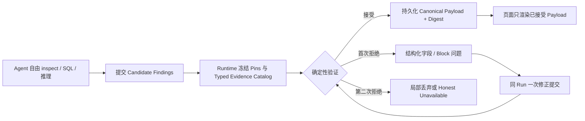

# AI Analyst Harness 与 AI Slot 执行路径

## 1. 目标、适用与不适用

### 目标

在不扩建通用 Agent 平台的前提下，让 EnergyIQ 的 AI：

1. 在同一授权 Project、Scope、Snapshot 与 cutoff 内正确查数和引用 Evidence；
2. 自主判断是否直接回答、继续调查、提出假设或停止；
3. 输出用户能直接理解和用于决策的 What → Why → How → Verify；
4. 在 Overview AI Slot 与 Full AI Analyst 中保持同一可信原则；
5. 用可重复 Eval 证明质量、稳定性和多轮连续性，而不是用一次演示判断完成。

固定优先级：

> 效果正确 > 调查稳定 > 多轮连续 > Cache 命中 > Token 成本

### 适用

- #30 AI Analyst Harness Eval 与客户问题集；
- #36 DeepSeek Context Budget、Cache 与轻量 Run Checkpoint；
- #9/#18/#35 中的 Ngee Ann、Preschool AI Slot；
- #15 Full Analyst 受控图表与异步 Run 的后续验收；
- #21 最终产品验收前的 AI 质量证据。

### 不适用

- 不修改确定性 Overview KPI、公式、Snapshot 或 Evidence；
- 不建设通用 Context、Memory、Prompt Optimizer、Scheduler 或 Provider Router；
- 不以固定 SQL、推理轮次、时间或 Token 上限代替 Agent 判断；
- 不在侧边分支直接修改主 Agent 尚未提交的 Overview/AI Slot 文件；
- 不用 Provider 连通性或单次成功冒充产品验收。

## 2. 三方职责

| 层 | 负责 | 不负责 |
| --- | --- | --- |
| Agent | 理解问题、选择工具、决定调查深度、形成 Finding、判断何时停止 | 授权自己、改写权威 KPI、伪造 Evidence |
| System | 授权、Project/Scope/Snapshot pin、只读 SQL、Evidence/Artifact 校验、结果持久化 | 替 Agent 规定固定调查路线或必须查几条 SQL |
| Harness | 验证正确性、安全、Evidence、连续性；记录效率和质量差异 | 用效率指标限制正确调查，或用关键词分数代替人工价值判断 |

Overview AI Slot 与 Full AI Analyst 均遵守以上职责。项目 Analysis Pack 可以不同，但不应形成两套可信原则。

## 3. 当前事实基线

### 已完成或基本完成

- #30 已有 10 个 Fast cases、真实 AG-UI Runner、确定性正确性/Evidence/Chart 校验和 Candidate-versus-Baseline 报告。
- #34 已完成 Agent/System/Harness 职责校准，并证明 10-case 实际结果可达到 10/10。
- #36 独立分支已完成 1M/32K DeepSeek budget、Context checkpoint、Cache telemetry 和固定三轮 same-session probe。
- #33 的晚绑定 SQL Claim Value 已作为 Integration commit `26d2fd1` 合入。
- Ngee Ann/Preschool AI Slot 已有异步状态、Finding Evidence、Ask AI deeper、Saved result 恢复和可选 Presentation Blocks 第一版。

### 真实剩余问题

1. #36/Harness 已合入 Integration；Ngee Ann 固定 Snapshot 的真实 DeepSeek pass@3 已完成，Preschool 连续追问仍需真实登录环境。
2. #30 当前 `insightQuality` 主要依赖关键词命中，不能充分判断逻辑、可读性和决策价值。
3. 两项目固定 SQL/强制 Finding 路线已移除；真实 Provider 仍可能产生单条错误 Evidence 引用，必须逐条拒绝并保留同批已验证 Finding。
4. #35 Presentation Blocks 已补服务端 materialization、Block 级 Evidence 绑定与无障碍语义；Ngee Ann 已完成一次真实 Provider、Evidence 和 1440/1920 验收，Preschool 与 tablet 仍待完成。
5. GitHub Issue 正文勾选状态滞后，必须用 commit、测试、Provider 和 Chrome 证据校准，不能仅看 checkbox。

## 4. 执行任务板

| 顺序 | 任务 | Owner | 状态 | 完成证据 |
| ---: | --- | --- | --- | --- |
| 1 | 将 #36/Harness 独立提交合入最新 Integration | 本侧边任务 | completed | Integration `7edd177`；7 files / 32 tests；build passed |
| 2 | 运行 #36 DeepSeek critical pass@3 + 固定三轮 same-session | 本侧边任务 | Ngee Ann pass@3 completed；Preschool real-auth blocked | Ngee Ann 3/3；Preschool CLI 被真实登录 401 阻止 |
| 3 | 将 #30 质量评分升级为结构化 Rubric，并保留确定性 hard gates | 本侧边任务 | implemented；real Candidate comparison pending | `7fb6977`；报告新增八维质量分解 |
| 4 | 增加重复调查与回答冗长的诊断遥测，不设效率硬门槛 | 本侧边任务 | completed | `7fb6977`；真实 pass@3 无重复 SQL，平均 701 词 |
| 5 | 校准 Ngee Ann/Preschool AI Slot 的固定 SQL/强制 Finding 路线 | 主 Agent | implemented；Provider pending | 0–3 Findings；Agent 自主调查；Evidence guard 不弱化 |
| 6 | 补齐 Ngee Ann 的 acted/ignored/verify 决策后果 | 主 Agent | planned | 两项目共享 Finding 语义；项目 Pack 保持独立 |
| 7 | 完成 #35 Provider 与 Presentation browser acceptance | 主 Agent + 本侧边复核 | Ngee Ann useful visual passed；Preschool running；no-visual/tablet pending | 两项目各有 useful visual 和正确 no-visual 案例 |
| 8 | 校准并关闭已完成 Ticket | 主 Agent | partial；#33 closed | #30/#36/#18/#35 继续按证据关闭 |
| 9 | #15 完整受控图表注册表 | 后续 | deferred | 仅在 Full Analyst 试点明确需要时推进 |
| 10 | #21 Charles/试点验收 | 用户/Charles | blocked by prior tasks | 人工确认信息价值、可读性、深度和行动价值 |

## 5. #30 最小质量 Eval 切片

### 5.1 保留的硬门槛

- 数字、单位、Period、Project、Scope、Snapshot 正确；
- Finding-specific Evidence 与 Chart data 能回到真实工具结果；
- 只读、无跨 Project/Workspace/Snapshot；
- 不泄露内部错误或协议字段；
- 不把假设写成已证明原因；
- Provider/Tool 失败时诚实失败，不伪造结果。

### 5.2 新增的软质量维度

每个 Insight case 独立记录，不用一个关键词总分掩盖弱项：

1. **Takeaway**：是否明确回答发生了什么；
2. **Evidence use**：是否用具体数字/范围支撑，而非只说“数据表明”；
3. **Decision relevance**：是否说明为什么值得关注；
4. **Action**：是否给出可执行的下一步，而非复述 Finding；
5. **Verification**：是否说明看什么结果来支持或推翻判断；
6. **Causal discipline**：是否区分事实、假设与 Missing Evidence；
7. **Readability**：是否先给结论、避免内部术语和不必要长文；
8. **Consequence**：当问题要求时，是否说明行动或不行动的可能后果。

确定性可判定项继续由代码判；主观价值作为 diagnostic rubric，后续可加入可选 LLM judge 和人工抽查，但不能覆盖 hard gate。

### 5.3 效率诊断

- SQL、Reasoning、latency、Token、Cache 和 Context 水位；
- 规范化 SQL 完全重复次数；
- Tool failure 是否恢复；
- 多轮是否复用同一 Evidence，还是无必要地重跑调查；
- 回答字数与首段长度，仅作为可读性诊断；
- 柔性停止原则：继续查询不会改变结论、行动或不确定性时，Agent 可以结束。

## 6. AI Slot 最小校准

### 6.1 Prompt/结果合同

- 返回 0–3 条最有价值 Finding；证据不足时允许 0 条；
- 不强制一条 Finding 对应一个 Horizon，也不强制覆盖全部 1d/7d/28d；
- 不规定固定成功 SQL 数或固定 observation/drill-down/validation 状态机；
- Agent 只引用实际使用的 Horizon、Discovery item 和 SQL Evidence；
- Ngee Ann 与 Preschool 共享 What/Why/Action/Expected/If ignored/Verify/Limitation 语义；
- Presentation 是可选表达，不要求每条 Finding 画图。

### 6.2 必须保留的安全边界

- 同 Workspace/Project/Scope/resource/Snapshot/cutoff；
- scoped read-only SQL；
- Finding-specific numeric Evidence；
- 权威 KPI 不被 AI 修改或冒充；
- unsupported cause、saving、ROI、owner、threshold 保持 Hypothesis/Missing Evidence 或拒绝；
- 刷新恢复已完成结果，相同 Context 不重复启动 Run；
- Ask AI deeper 复用 Session/Project/Finding/Evidence。

### 6.3 Provider 验收

Ngee Ann 与 Preschool 各运行至少三次固定 Profile/Snapshot：

- available/empty/fail-closed 状态正确；
- 非空 Finding 有实际决策价值且不重复 Overview；
- 所有数字与 Presentation 回到 Finding-specific Evidence；
- Agent 自主选择有用 visual，且至少一次正确选择 no visual；
- 记录 latency、SQL、recovery、Token/Cache，不把效率设为质量门槛；
- 人工检查 plain language、图文协同和行动后果。

## 7. 验收与关闭顺序

1. [x] #36/Harness commits 合入并通过自动回归；
2. [x] #36 Ngee Ann real pass@3；Preschool same-session 保留为真实登录环境验收；
3. [x] #30 结构化质量 Rubric 与报告回归；
4. [x] AI Slot 固定路线完成代码校准；Ngee Ann 已有真实运行证据，Preschool 继续验收；
5. [ ] #35 Ngee Ann useful visual、Evidence、1440/1920 已通过；Preschool、no-visual 与 tablet 待验；
6. [ ] #20 History keyboard/1440/1920 验收；
7. [x] 关闭已合入的 #33（`26d2fd1`；专项回归 4 files / 53 tests）；
8. [ ] 校准 #30/#36/#18/#35 正文或评论；
9. [ ] 最后进入 #21 Charles/试点验收。

自动测试、真实 Provider、Chrome 和 Charles 人工验收必须分层记录，不互相替代。

## 8. 失败模式

| 现象 | 可能原因 | 处理 |
| --- | --- | --- |
| 关键词分数高但答案没价值 | Rubric 只检查词语，没有检查逻辑与决策链 | 输出分维度结果；增加人工/可选 judge，不改 hard gate |
| Agent 重复查询或运行很慢 | Tool feedback 不清楚、上下文重复、模型不确定是否可结束 | 先用 #36/#30 遥测定位；改反馈与柔性停止提示，不设硬 SQL 上限 |
| AI Slot 经常 unavailable | 严格 JSON、固定 SQL 次数或强制三条 Finding 造成机械失败 | 放宽路线和数量，保留 Evidence/安全校验 |
| 图表数字校验失败 | 模型重复抄写数据或 Block 未绑定具体 Evidence | 服务端 materialize；Block 绑定 Evidence；Finding prose 仍可降级展示 |
| 多轮追问重新调查 | Session/Evidence 没恢复或模型不知道可复用 | 检查 checkpoint、thread、Snapshot；Harness 比较各轮 SQL/Evidence |
| 合并冲突 | 侧边分支修改主 Agent 的未提交 AI Slot 文件 | 等主 Agent 提交后再 rebase/cherry-pick；当前仅做 Harness 独立文件 |

## 9. 明确停止项

- 不创建新的 Context/Memory/Evidence/Artifact 平台；
- 不增加三路线意图分类器或固定分析状态机；
- 不用 SQL/轮次/延迟/Token 作为答案质量硬上限；
- 不为了 Cache 改变语义顺序或删除必要 Evidence；
- 不要求每个 Finding 有图，也不让浏览器执行模型生成代码；
- 不因 AI 失败阻塞确定性 Overview；
- 不在 Provider 真实证据前宣称 #30/#36/#18/#35 完成。

## 10. 维护规则

- 每完成一个切片，更新任务板状态和“完成证据”，不新增竞争文档；
- GitHub Issue 记录正式 AC/关闭状态，本文件记录跨 Ticket 顺序与依赖；
- 代码完成、自动测试、Provider、Chrome、Charles 验收分别标记；
- 发生新问题：范围内写入对应任务；超出范围写入失败模式或 deferred，不立即扩大实现；
- 文档更新必须引用实际 commit/report，不凭聊天记忆宣布完成。

## 11. 2026-08-08 当前执行记录

### #36 已完成代码提交与 Integration 合入

按顺序：

1. `0391b2e`：校准官方 DeepSeek V4 Flash 1M/32K Context budget；
2. `91ebb3d`：暴露 Context checkpoint telemetry；
3. `7febf78`：记录 Provider Cache telemetry；
4. `4866dd4`：在 Eval 报告每步 Context 构成；
5. `2dc959f`：加入固定三轮 same-session continuity；
6. `27df662`：修复预算一致性、Token 去重和 checkpoint 计数。

以上提交及后续 #30/稳定性/表达切片已按顺序进入 Integration `7edd177`。合入后聚焦回归
7 files / 32 tests 与根 build 通过；主 Agent 的未提交 Overview/Presentation 文件未被 stage、commit 或覆盖。

### #30 质量诊断切片

提交：`7fb6977 feat(eval): expose decision quality diagnostics`

新增：

- Takeaway、Evidence use、Decision relevance、Action、Verification、Causal discipline、Readability、Consequence 八维分解；
- 回答总字数、首两句字数；
- 规范化 SQL 的完全重复计数；
- Suite summary、Markdown 和 Candidate-versus-Baseline delta；
- 旧 Baseline 缺少新字段时返回 `null` delta，不产生伪造数值；
- 以上均为质量/效率诊断，没有增加 SQL、轮次、时间或 Token hard gate。

自动证据：

- Harness/Context 聚焦回归：5 files / 28 tests passed；
- 根 `npm run build` passed；
- Mastra stream normalizer contract passed；
- Eval script syntax 与 `git diff --check` passed。

限制：当前八维自动分解仍是透明的规则型 diagnostic，不等于人类价值判断。真实 Candidate/Baseline、可选 LLM judge 与 Charles 抽查仍待后续证据。

### Ticket 维护

- #30 进度证据：<https://github.com/Zion74/energyiq-datafoundry/issues/30#issuecomment-5219684498>
- #36 最新合入交接：<https://github.com/Zion74/energyiq-datafoundry/issues/36#issuecomment-5219684718>
- #33 已验证并关闭：<https://github.com/Zion74/energyiq-datafoundry/issues/33#issuecomment-5219684918>

### Ngee Ann 真实 DeepSeek 验收与修复

验收使用隔离 Metadata/File storage、受保护的 Ngee Ann 事实库和固定 Snapshot
`energy-snapshot-03499dcda183ae28c47f7d66`。没有停止当前 Integration 服务，也没有修改共享事实或登录状态。

第一次有效 pass@3 为 2/3。第三次并非模型结论错误，而是 Context Processor 在 SQL 工具返回
`undefined` observation 时对非字符串调用 `.slice()`，导致 Harness 自身崩溃。已用可复现红测锁定并修复：

- `9c14107 fix(agent): tolerate missing SQL observations`；
- 精确回归 3/3、相关 Context 回归 4/4、根 build 均通过；
- 修复后相同 Ngee Ann case 的真实 DeepSeek pass@3 为 3/3，hard failure 0。

修复后 pass@3 摘要：

| 指标 | 结果 |
| --- | ---: |
| Correctness / Insight | 1.00 / 10.00 |
| p50 / p95 | 139.5s / 206.2s |
| 平均 SQL / Reasoning rounds | 14.33 / 9.33 |
| 完全重复 SQL | 0 |
| Tool failure / recovered | 1 / 1 |
| Max prompt / budget utilization | 67,630 / 5.09% |
| Cache hit tokens / ratio | 653,568 / 1.00 |
| 平均 Decision Quality / Answer words | 0.75 / 701.3 |

结论：1M Context budget 不是当前性能瓶颈；DuckDB 也不是本次 139–206 秒的主要原因。
耗时主要来自模型自主选择了 9.33 个推理轮次和 14.33 条 SQL。因为没有重复 SQL且失败能恢复，
不应增加固定 SQL/轮次硬上限。当前应优化工具反馈、停止判断和最终表达，而不是限制调查能力。

### 决策简报最小优化

提交 `e8d5a16 feat(agent): default EnergyIQ answers to decision briefs` 只调整最终表达合同：默认把单一决策问题
组织为不超过五个短要点的简报，保留一个 takeaway、最多三个决定性 Evidence、一个行动和一个验证；
这不是分析或工具预算，不阻止 Agent 在需要时继续调查。

三次真实 Provider 单次试验均通过 correctness 1.00 / Insight 10：

- 96.4s、9 SQL、6 rounds、366 words；
- 119.8s、13 SQL、10 rounds、498 words；
- 最终文案：86.7s、9 SQL、6 rounds、359 words。

它已把 3-run 平均 701 词显著压短，但 DeepSeek 仍可能超过 300 词目标。今晚不增加第二个总结模型或
通用 Prompt 平台；AI Slot 的卡片级裁剪继续由 Presentation/renderer 负责。

提交 `5b094ff feat(agent): clarify autonomous stopping judgment` 补齐柔性停止原则：当新增查询不会改变
结论、下一步行动或实质不确定性时，Agent 可以结束调查。这一原则明确不是固定 query/step limit，
不会替 Agent 选择路线。聚焦回归 5 files / 9 tests 与根 build 通过。相同隔离 Snapshot 的真实
DeepSeek 单次复核也通过：correctness 1.00、Insight 10、decision quality 0.8125、323 words、
107.3s、13 SQL、9 reasoning rounds、重复 SQL 0、max budget utilization 3.38%。因此没有观察到
柔性停止导致的过早回答或质量下降。

### Preschool same-session 的诚实边界

对当前 `127.0.0.1:8787` 运行 fixed three-turn continuity 时，CLI 在进入模型前收到 `401 Authentication required`。
当前 API 使用真实浏览器 Session，并同时持有项目 DuckDB；不应停服务、复制登录凭据或切换 dev-auth 来制造通过。
因此当前证据边界是：same-session 自动契约测试已通过，但 Preschool 真实 Provider 连续会话仍需在已登录 UI 或
经正式测试账号/Token 的隔离实例完成。该 401 不是 DeepSeek、SQL 或结果质量失败。

### AI Slot 固定路线复核

最新 Integration 的未提交 AI Slot 仍存在两类限制：

- Ngee Ann：最多两次 SQL、第一次成功立即停止、必须恰好三条 Finding、强制覆盖 1d/7d/28d；
- Preschool：固定 observation → drill-down → validation，并要求每条 Finding 至少引用两条 SQL。

这些规则超出了安全/Evidence 边界，确实会限制 Agent 自主调查。但相关文件正包含主 Agent 的 Presentation WIP，
侧边分支不直接改动，避免覆盖或制造难解冲突。安全切片应在该 WIP 提交后单独完成：保留 inspect-first、只读、
Snapshot pin、数字 Evidence 与 fail-closed；删除固定调查状态机、成功 SQL 数和“恰好三条”要求，允许 0–3 条有价值 Finding。

### #35 Presentation Blocks 可信闭环

当前实现采用一个小型、版本化的共享 Presentation contract，不引入可执行模型代码或通用页面 DSL。模型只能在
metric、comparison、ranking、share、distribution、trend、heatmap、table 与 callout 这组安全 Block 中自主选用；
图表是可选表达，系统不设置图表配额。

本切片补齐：

- 定量 Block 必须携带属于当前 Finding 的 `evidenceRefs` 或 `evidenceSqlIndexes`；
- API 在保存和恢复前重新 parse、过滤和 materialize，不能持久化任意 HTML、脚本或未引用数字；
- 每个 Block 只用它自己绑定的 Evidence 校验数字，单个无效 Block 局部降级，不隐藏整个 Finding；
- Saved Analysis/Resume 读取同一份净化后的 Presentation Artifact，不触发新模型运行；
- trend、heatmap 与 table 提供非颜色依赖的辅助技术语义；
- Ngee Ann 与 Preschool 复用同一 contract 和 prompt 片段，项目分析逻辑仍保持独立。

自动证据：共享 contracts build、根 typecheck、Presentation/两项目 AI Slot/Saved Analysis 聚焦回归
7 files / 107 tests passed，`git diff --check` passed。该证据只证明代码合同和回归；真实 Provider 是否自主选择
有用 visual 或正确 no-visual、以及 1440/1920/tablet 的人工阅读效果，仍作为 #35 未完成的运行时验收。

远程检查点为 `27b0b0a`，服务端 materialization、Block 级 Evidence 与无障碍闭环为 `1da1690`，均位于
`codex/t35-presentation-checkpoint`。未包含本地生成物、凭据、私有 Excel 或并行工作树漂移。

### #18 自主调查路线校准

Ngee Ann 与 Preschool 的页面级 AI Slot 已从固定调查脚本改为受控自主调查：

- inspect-first、授权 Project/Scope/Release/Snapshot、只读 SQL 和 Finding-specific 数字 Evidence 继续硬性执行；
- 简单问题允许一条成功 SQL，复杂问题允许多条不同查询；SQL 被拒后可根据 Tool feedback 重规划；
- 当新增查询不会改变结论、下一步行动或实质不确定性时，由 Agent 判断停止；
- 两项目均返回 0–3 条非重复 Finding，证据不足时允许 0，不再填满三条；
- Ngee Ann 不再机械覆盖 1d/7d/28d，也不强制使用 Category/Circuit/time 维度；声明某个 Horizon 时仍必须引用对应 Evidence；
- Preschool 不再硬编码 observation → drill-down → validation，不再要求每条 Finding 至少两条 SQL 或总共 2–4 条；
- 单条 SQL Evidence 仍最多返回 10 行，避免把大结果集当页面 Evidence；安全与可复现边界未放宽；
- Saved Analysis 对 Ngee Ann 的结果数量同步允许 0–3，恢复时仍使用同一净化后的 Artifact。

自动证据：两项目 Run/Slot、Saved Analysis 共 5 files / 105 tests passed，根 typecheck 与 build passed。
该证据不等于真实模型价值验收；下一步仍需用相同授权 Profile/Snapshot 连续运行，并分别记录 0–3 Finding、
查询深度、数字 Evidence、延迟和人工决策价值。

### #18/#35 真实 Ngee Ann Run 收口

真实 DeepSeek V4 Flash Run `ngee-ann-overview-56d0add1-673c-4672-87ce-cfa9e534854b` 在同一授权
Ngee Ann Snapshot 上完成，耗时约 224 秒，执行 1 次 Schema 与 8 次只读 SQL。模型返回 3 条候选：前两条使用了
不存在的 path-like Discovery Evidence id；第 3 条为 SQL-only 的 Circuit reconciliation Finding，引用 SQL 2/6/7，
指出 14 个 component Circuits 合计 9,619.4663 kWh，相对 official 9,736.4214 kWh 有 116.9551 kWh 差额。

运行时复核暴露并修复三个窄问题：

1. Ngee Ann 原先任一候选校验失败会隐藏整批结果；现改为逐条拒绝 Horizon、deterministic ref、SQL ref 或数字
   Evidence 无效的 Finding，保留同批已验证 sibling；如果全部失败，AI 层仍 fail closed，确定性 Overview 不受影响；
2. SQL array rows 的紧凑 JSON 逗号曾被数字 tokenizer 误当千位分隔符，导致工具已返回的精确数字被误拒；现用有
   whitespace 边界的序列化并增加多列数组行回归；
3. 持久化 Trace 曾过滤模型流中的 whitespace-only chunk，恢复后会出现 `covers98.8%`；Trace 现完整保留原始文本
   chunk。该项自动回归通过，但当前 8787 实例未能在安全策略下重启，因此浏览器运行态复验要等正常 API 重启。

自动证据：Ngee Ann Run 与 Trace 2 files / 49 tests passed，根 typecheck passed。Chrome 已确认旧 Run 无需重新调用
模型即可恢复第 3 条有效 Finding；1440/1920 与 768px 基本 tablet 布局无横向裁切，当前代码刷新后的控制台无新增错误；
AI-selected comparison visual、Snapshot、3 条 SQL、
Audit ids 与 Finding-specific Evidence 对话框一致。当前旧 API 实例仍显示修复前的空格缺失，不能把自动修复冒充为
运行态已发布。

### #35 真实 Preschool Run 边界

登录态 Chrome 使用同一 Preschool Snapshot 完成两次真实 DeepSeek V4 Flash 运行，没有修改确定性 Overview：

1. Run `preschool-overview-cd5eec65-de9e-45f0-ba69-7e559d282bb0` 约 214 秒完成，执行 1 次 Schema 与 9 次只读
   SQL。三个候选中，前两个引用了不存在的 path-like Discovery Evidence id；第三个虽只引用 SQL，却把 Top-N
   返回行数“10”写成业务结论，而该数量并不是 SQL 返回的命名字段。Finding-specific 守卫按合同拒绝整批，未把
   未验证数字或伪 Evidence 显示给用户；
2. 页面重新加载后启动的 Run `preschool-overview-706701e9-476a-4759-8774-5197f52ae92a` 在 300 秒边界超时，
   已完成 7 次工具结果但未形成可验证最终 Artifact。页面保持 fail-soft，确定性 Overview 继续可用；不通过增加
   固定 SQL/轮次限制、提高超时或放宽 Evidence 守卫制造通过；
3. 超时链曾把 `BodyStreamBuffer was aborted` 暴露给用户。现将内部 timeout、错误码、网络与 abort 类错误统一
   映射为客户安全的暂时不可用提示，并增加 `RUN_TIMEOUT:300000` 与 stream abort 回归。业务校验失败原因仍保留，
   便于区分“模型结果不可验证”和“运行时暂时失败”。

当时未继续触发第三次 Provider Run。该轮结论是：Ngee Ann 已有一条真实 visual Finding 的 Chrome 证据；Preschool
仍缺少一次同时通过可信合同与客户表达的真实 Run，因此 #35 不能关闭。完成但全部候选被拒的 Run 在重新加载时会
再次尝试，是后续 Resume/Retry policy 的独立窄问题，不在本切片扩成调度或通用缓存平台。

### #18/#35 Preschool 后续真实验收与最小修复

登录态 Chrome 在同一 Published Snapshot 上继续运行，确定性 Overview 始终先显示且未被 AI 失败修改。本轮确认的
首要根因不是 DuckDB：Run `preschool-overview-ecb5f783-27d6-40aa-9628-5bdee83fa277` 约 233 秒内完成 7 条 SQL，
但页面提示词中的 `no chart quota` 被 Harness 关键词识别为“用户明确要求图表”，强制首个查询返回 2–500 行；这与
Preschool 单条页面 Evidence 最多 10 行的合同冲突。现将提示改为 `presentation-block quota`，保留 Agent 自主选择
Presentation 的能力，不再误触发 Artifact chart fast path。

结果校验从“任意探索 SQL 超行则整批失败”收窄为 Finding-specific：超 10 行的查询只淘汰实际引用它的 Finding；
未引用的探索查询不再连坐有效 sibling。显式引用或自动修复后新增引用的超行查询仍 fail closed。Ngee Ann 与
Preschool 输出合同分别提升至 v5/v9，避免同 Snapshot 恢复旧提示生成的结果；Saved Analysis 中已冻结的历史结果
不被改写。

v9 三次真实 Run 证据：

| Run | 耗时 | SQL | 结果 |
| --- | ---: | ---: | --- |
| `preschool-overview-f158f061-2f2f-45e7-a7dc-8a5696165cbf` | 184s | 5 | Evidence id 已限制为合法集合；Provider 使用 `next` 与顶层 `blocks` 等价字段，旧解析器拒绝 |
| `preschool-overview-e21b30cc-1262-41b2-b214-50813e6f8427` | 251s | 11 | 一条被 Finding 实际需要的查询返回 24 行，且叙述未绑定对应 SQL，数字守卫正确拒绝 |
| `preschool-overview-7ca9322f-8bdd-4693-80fb-936f88384876` | 164s | 6 | 生成 3 条候选；至少一条把实际返回行数写在 limitation，旧守卫将审计行数误当业务数字 |

解析器现兼容 `next → how`、顶层 `blocks → presentation.blocks`；缺少纯展示关系时使用中性的 `independent`，避免
根据 Evidence 引用臆断 supports/challenges。数值、Snapshot、SQL 行数与 Evidence 守卫不变。只有 `evidenceNote`
限制说明中的“实际返回 N 行”，且 N 精确等于该 Finding 所引用工具的 `returnedRowCount` 时，才作为结构上下文移除；
What/Why/Action/Presentation 中的相同数字仍须正常取证。不匹配行数、Top-N 业务结论、能耗、
比例、成本和派生数字仍拒绝。自动证据为 Presentation/两项目 Run 4 files / 98 tests、根 typecheck/build 通过；最新窄测
继续覆盖等价字段、未引用超行隔离、引用超行拒绝与真实返回行数/错误行数分支。

完整重载恢复后，三份 v9 Artifact 仍均无可显示 Finding，真实结果为 0/3 useful。恢复动作意外触发的第 4 次 Run
`preschool-overview-28c1ede5-2852-4827-92b3-3688cd913d4b` 也在约 266 秒、7 条成功 SQL（单条最多 9 行）后被
Finding-specific 数字守卫拒绝；它进一步证明剩余问题不是 10 行限制本身，而是模型继续输出未被同 Finding 精确引用的
派生/排名/上下文数字。确定性 Overview 仍完整可用。

因此不能关闭 #18/#35，也不继续自动重跑。以上真实失败样本进入 #30 Harness/Prompt 质量任务；下一步应让 Agent 在
最终提交前使用现有工具结果自检引用，或减少没有必要的派生数字，而不是放宽能耗、比例、成本守卫或建设通用调度平台。
Preschool 的 1440/1920/tablet useful visual 验收等待至少一条可信 Artifact 后再执行。

## 12. 自主探索与输出验真校准

### 12.1 独立结论

采用“开放调查、严格发布”的双阶段边界，但不能把它简化成数字白名单。当前 0/3 的真实证据证明 post-hoc 拒绝能守住
正确性，却不能稳定交付价值；下一切片要把校验反馈前移到提交阶段，同时保留最终 fail closed。

### 12.2 已识别的潜在问题

| 风险 | 可能后果 | 最小控制 |
| --- | --- | --- |
| 相同数字出现在不同查询或维度 | 错误 Evidence 也可能“数值匹配” | 同时校验 metric、unit、Scope、window、dimension；自动补绑定只接受唯一 typed match |
| 合法派生值不直接存在于行中 | 误杀正确排名、比例或差值 | 要求 SQL/受控工具输出最终命名字段；不在浏览器或模型文本中补算 |
| 模型为通过校验而回避数字 | 文案安全但空泛，没有决策价值 | #30 的 Insight rubric 与人工价值验收独立于 correctness gate |
| 修正循环重新查询或不断重跑 | 延迟、费用和结果漂移扩大 | post-validation 最多一次定向修正，复用同一 Run/Snapshot；失败后局部丢弃或 honest unavailable |
| 校验器自身误判 | 有效 Finding 被拒，或无效 Finding 放行 | 固定四次真实失败 transcript、篡改变体和 Golden 回归；记录字段级 reason code |
| 数字正确但因果/行动过度 | 形成错误决策建议 | 原因分 Fact/Hypothesis/Missing Evidence；量化后果必须另有 Evidence，无法自动证明的价值留给人工 rubric |
| 新合同恢复旧 Artifact | 修复后页面仍显示旧错误 | bump output contract revision，并把 revision 纳入恢复 fingerprint |
| 无效图表拖垮整条洞察 | 有价值文字也被隐藏 | Presentation Block 与 Finding 分层校验，Block 可局部降级 |

### 12.3 #30 下一实施切片

1. 把四次 Preschool 真实失败输出加入固定回归样本，保留原工具结果和失败字段；
2. 生成最终 JSON 前，让 Agent 检查每个客户可见数字是否具备当前 Finding 的 typed Evidence；派生事实没有最终 SQL 字段时，
   删除数字、降级为 Hypothesis/Missing Evidence，或在结束调查前自行补一次定向 SQL；
3. 服务端继续执行确定性校验；返回字段级失败原因，并只允许一次复用同一 Context 的定向文案修正，不重新跑 Overview、
   不静默换模型、不放宽 Snapshot/授权/只读/Evidence 守卫；
4. 自动 Evidence 补绑定改为仅唯一 typed match；多条候选时拒绝静默绑定；
5. 单个 Presentation Block、单个 Finding、同批 sibling 分别验证和局部降级；
6. 校验合同升版，补 Cache/Resume 回归，确保旧 Artifact 不被当成新合同结果；
7. 自动回归通过后，对相同 Preschool Profile/Snapshot 固定运行 3 次：目标至少 2/3 产生非空、可理解、
   Finding-specific Evidence 的 useful 结果，hard safety failure 必须为 0；再进行 1440/1920/tablet 与 Evidence 弹窗验收。

### 12.4 停止项与复审条件

- 不增加固定分析主题、SQL 次数、工具顺序或新颖性配额；
- 不用第二个 LLM Judge 决定事实正确性；
- 不构建通用 Claim Graph、公式 DSL、Provider Router 或自动 Prompt Optimizer；
- 不因 0/3 而放松数值、Snapshot、授权或只读 SQL 守卫；
- 若一次定向修正仍频繁触发、明显增加时延但 useful 率没有改善，停止叠加 Prompt/重试，重新检查 Evidence 提交接口；
- 若通过率提高但人工判断仍是复读图表、空泛建议或不说人话，不关闭 #18/#35，转为表达与分析价值问题处理。

### 12.5 2026-08-08 首个实现切片

已完成 Preschool 本地输出合同 v10 的第一层可信闭环：

- 最终 JSON 前增加逐字段自检提示，同时保留既有的 cause、tariff、cost、savings、ROI、forecast 等禁止臆造约束；
- SQL Evidence 从“某个查询里出现过相同数字”收紧为 typed cell，保留 column、row 和同行字符串维度；
- Bundle Evidence 同样按字段类型和 Centre 维度匹配，`30 centres` 不再能授权 `30 kWh`；
- 实体既支持数字前也支持数字后、多字符 Centre 和跨字段代词；同一数值语句出现多个 Centre 时 fail closed；
- EUI、per-pax、currency 与能量单位分型校验，远距离 `cost` 和 `MWh` 不能由同值 `kWh` 字段授权；
- 自动补 Evidence 只接受全局唯一的 typed cell；同一 SQL 多行同值、SQL 与 Bundle 同值、错误 Centre 同值均拒绝静默绑定；
- 已有引用指向错误 Centre 时不自动追加另一个引用掩盖错误；
- 字段级校验结果保留原始 Provider candidate index，前序 sibling 被淘汰后不会错报 Finding；
- output contract 从 v9 升至 v10，避免同一 Snapshot 恢复旧合同 Artifact；Saved Analysis 中已冻结的历史结果不改写。

自动证据：Preschool Run 65 tests passed；Presentation、两项目 Run/Slot 共 6 files / 139 tests passed；Harness Eval
18 tests passed；根 typecheck、build 与 `git diff --check` passed。四次真实失败 Run 只用于确认失败形态；回归采用匿名 synthetic events，
不把原始推理、SQL、客户上下文或真实 Artifact 复制进 Git。

尚未宣称完成“一次定向修正”。当前 `validatePreschoolAiEventStream` 已能输出字段级问题，系统继续局部丢弃无效 Finding
或 honest unavailable；不以 Prompt 自检冒充提交后修正。安全修正需要的 governed submit seam 保留为架构候选，
**不是当前 MVP 的下一实现切片或客户验收前置**。只有 14.7 所列真实失败证据出现时，才重新开启这一方案评审。

## 13. #30 Output Submit 架构独立复核

> **当前状态（2026-08-08）**：本节保留为已完成的架构评审和未来触发式备选方案，不代表已批准实施。
> 当前执行以第 14 节为准：v10 是 MVP 安全底线；完整 canonical submit、同 Run repair 和 Pack Typed Evidence
> 扩展均 `DEFERRED BY EVIDENCE`。

### 13.1 结论：部分同意

采用以下产品原则：

> Agent 决定调查什么、解释什么；Runtime 决定哪些结构化事实、数字和图表数据有资格作为可信结果展示。

但 Runtime 不能声称“证明整个 Finding”。它可以确定性验证实体、指标、值、单位、维度、授权窗口和来源是否一致；
不能仅靠规则证明自然语言因果、行动价值或未来结果。后者仍必须显式标为 Evidence、Hypothesis 或 Missing Evidence，
并由 Harness rubric 与人工验收判断价值。

### 13.2 可复用与不可硬套的现有机制

| 现有能力 | 决定 | 原因 |
| --- | --- | --- |
| `ActionRouter` / `ProtocolRuntime` | 复用机制 | 已有 server policy、授权、requested/succeeded/failed journal、Context revision CAS、持久化 Protocol State 和同 Run 工具反馈 |
| `GovernedToolFactory` / Tool error observation | 复用机制 | 能在现有模型工具循环内返回结构化 rejection 与 recovery，不需要第二个 Agent Runtime |
| `analysis-requirements-commit` 生命周期 | 参考 | 已证明 Proposal → server validate → feedback → retry 能在同一 Run 工作 |
| `analysis-requirements-commit` 具体 Tool/Reducer | 不直接复用 | 面向预定义 Requirement；manual claim prose 与 Presentation 不验真；显式 Evidence 不匹配时存在回退到 candidate bindings 的兼容逻辑，不符合唯一 typed binding |
| `proposeCompletion` | 不作为修正入口 | 它负责整个 Run 终态；当前 API 在模型自由文本完成后 force terminal，无法把 post-hoc Web rejection 送回已经结束的 Agent loop |
| 当前 Web `validatePreschoolAiEventStream` | 仅保留为防御与回归 | 能 fail closed，但发生在 `RUN_FINISHED` 后，不是 Runtime referee，也不能安全触发 same-Run repair |

另一个必须修复的 TOCTOU 风险是：即使 `analysis_requirements_commit` 已接受 Claim，模型后续自由文本仍可能写出不同数字。
可信页面必须渲染 Runtime 接受并持久化的 canonical payload；不能继续把最后一段自由文本当权威结果。

### 13.3 推荐的最小深 Module

只新增一个窄 Interface，不建设 Claim Graph、公式 DSL 或通用治理平台：

```ts
submitAnalysisOutput({
  contractId,
  contractRevision,
  baseRevision,
  findings,
}): AcceptedOutput | RejectedOutput
```

Agent-facing Tool 可命名为 `analysis_output_submit`，内部 Action 为 `analysis.output.submit`。生命周期复用现有
Action Router 与 Protocol State；Ngee Ann、Preschool 各自提供小型 Evidence Adapter，不共享项目分析路线。



第一次 rejection 后进入 output-repair phase：锁定同一 `runId/segmentId`、Project、Scope、Snapshot、Period 和
Evidence catalog，只允许一次 `analysis_output_submit` 修正，不再 inspect 或查询。缺少派生事实时应删除数字或降级为
Hypothesis/Missing Evidence；若 Agent 希望保留排名、比例或差值，必须在第一次提交前让 SQL 返回最终命名字段。

第二次提交携带 `baseRevision`。Runtime 必须验证已通过 sibling 未被改写，仅允许修改 rejection 指向的 Finding/字段/Block。
接受后把 canonical payload、digest、attempt count、contract revision 和 catalog digest 写入持久化 Protocol State/Session
journal。只依赖进程内 idempotency Map 不足以支持重启恢复。

### 13.4 Typed Evidence MVP

不要在每个 cell 重复 Project/Snapshot 等信息。最小结构分两层：

1. Catalog envelope：Workspace、Project、Scope、Resource、Snapshot、Release、Period、timezone、contract revision；
2. Evidence cell：`sourceRef + metricId + value + unit + row/dimensions`。

其中实体、日期、Horizon、Category、Circuit 等属于 `dimensions`；SQL Artifact/Audit/Tool call 或 Bundle item 属于
`sourceRef`。排名、比例、差值不建立通用 derivation graph：MVP 只接受 SQL/受控工具返回的最终命名字段。

自然语言不是主要数据接口。Candidate 应把客户文案与结构化 facts/Presentation 分开；数字和图表从已验证 fact/cell
materialize。自由文案中的额外数字继续由 parser 作为防御检查，但不能以列名关键词和数字相等作为主要证明方式。

### 13.5 反证、风险与验收

| 风险 | 最小处理 |
| --- | --- |
| Validator false positive | 使用证据坐标和 Pack metric registry；EUI、kWh/pax、currency、count、ratio 分类型回归，不靠通用字符串猜测 |
| Validator false negative | 同值不同实体、同行维度互换、远距离实体、多字符 Centre、未知单位全部 tamper 测试；未知类型 fail closed |
| Agent 为过门而输出空话 | correctness gate 与 decision-value rubric 分开；无数字不等于 useful |
| 修正增加时延和成本 | 无第二模型/第二 Run；只有首次 rejection 多一个模型回合；第二次失败停止 |
| 修正时偷偷重查或改变 sibling | repair phase 禁用数据工具；base digest + sibling digest 校验 |
| 接受后自由文本漂移 | 页面与 Saved Analysis 只使用 canonical accepted payload，不读取后续自由文本作为权威 |
| 进程重启重置修正预算 | attempts、issues、catalog digest、accepted payload/digest 持久化到现有 Metadata Protocol State |
| 旧 Artifact 恢复 | identity 同时包含 Pack、output contract 与 validator revision；Saved historical Artifact 不改写 |

若 14.7 的证据以后触发实现，届时第一切片也只能为 Preschool 接入以上闭环并跑匿名 transcript/tamper 回归；
稳定后才评估是否需要 Ngee Ann Adapter。若实现要求新增第二套 Session、Artifact、Query Receipt 或历史版本平台，
立即停止并缩小方案。

## 14. 2026-08-08 客户价值主线与轻量通用化路线

### 14.1 当前总目标

从本节开始，停止把 #30 Output Submit、一次定向修正或通用 Typed Evidence Adapter 作为当前主线。Preschool v10
继续承担安全底线；新的工程投入按以下顺序服务同一个结果：

> 用户在 60 秒内先看到 Takeaway，理解问题与影响，再看到合适的图和下一步；AI Slot 只补充真正有价值的调查角度。

本路线适用于 Ngee Ann 与 Preschool 当前 MVP 收口。不适用于 Runtime 平台扩建、第三方 Provider 路由、通用 BI
模板、Scheduler 或自动生成任意页面。

### 14.2 可跟踪执行顺序

| 顺序 | 任务 | Ticket | 完成判据 | 当前决定 |
| --- | --- | --- | --- | --- |
| 0 | 冻结可信基线 | #30 | v10 tamper 回归、两项目相关测试、typecheck/build 通过 | 已完成；除真实验收反证外不继续扩建 |
| 1 | 两项目当前效果基线验收 | #9、#13、#18、#35 | 分开记录自动测试、真实 Provider、1440/1920/tablet Chrome 和 Charles/用户判断；不混写为“全部通过” | 当前第一任务 |
| 2 | Overview 60 秒信息表达 | #9、#13 | 首屏先给 0–3 个 Takeaway；每个主题形成“结论 → 关键数字/小图 → 影响 → 下一步”；技术信息默认折叠 | 基线验收后立即执行 |
| 3 | AI Slot 展示优化 | #18、#35 | AI 自主选择文字或受控 Presentation Block；重点一眼可见，正文可略读，Evidence 不占主阅读路径 | 与第 2 项按模块垂直交付 |
| 4 | 受控 AI 图表只补真实需要 | #15、#35 | 只有 Finding 用图比文字更清楚时才生成；图表值与同 Finding Evidence 一致 | 不设图表配额，不为关闭 Ticket 强行画图 |
| 5 | 两项目产品验收与试点收口 | #21 | Ngee Ann 与 Preschool 均完成 A→B 连续数据、Overview、Explorer 下钻、AI 降级和人工价值验收 | 最终试点门禁 |
| 6 | Harness/性能后续 | #30、#36 | 仅处理真实验收暴露且阻塞客户结果的问题 | 不与视觉主线竞争优先级 |

每个客户可见模块按同一垂直链交付：

`用户问题 → Takeaway → 权威数字/比较 → 最合适的图 → 影响 → 行动/调查 → 验证 → 可展开 Evidence`

不再先做一批后端能力，再等最后一个 Ticket 才首次看到页面效果。

### 14.3 验收分层

1. **自动证据**：focused tests、Harness Eval、typecheck、build；
2. **真实 Runtime 证据**：固定 Profile/Snapshot 的 Provider Run、工具序列、结果分类；
3. **Chrome 证据**：1440、1920、tablet，检查首屏、字号、裁切、交互、History/Evidence；
4. **人工产品验收**：用户是否能在 60 秒说出“发生什么、为什么重要、下一步做什么”。

前一层通过不能代替后一层。Provider connected 不等于 AI 有价值，Chrome 没报错也不等于 Charles 接受。

### 14.4 第一项客户可见交付物

先产出两项目“当前页面 60 秒阅读基线”，只回答：

1. 首屏最先看到的 Takeaway 是什么；
2. 哪些信息用户必须寻找或阅读长段文字才能得到；
3. 哪些图没有帮助解释结论，哪些结论缺少图；
4. AI Slot 的三秒重点、展开信息和 Evidence 是否分层；
5. 第一项最小改动能否在一张 1440/1920 对照图中证明价值提高。

基线形成后，第一项代码切片固定为 **AI Finding 首屏决策密度收口**：

- 首屏依次能看到一句 Takeaway、Why 和推荐下一步；
- Agent 按当前 Finding 自主选择 0～N 个 Presentation Blocks，并声明哪些是初始阅读必需的 `primary`、哪些是可折叠的 `supporting`；
- 页面直接展示全部 `primary`，只折叠 Agent 明确标为 `supporting` 的次级表达，不再强制“只能一张主图”；
- 没有图表时不渲染空容器；
- Preschool 的“做了 / 不做的后果”保持紧凑，Evidence、验证方式和限制继续折叠；
- Runtime 继续校验每个定量 Block 的 Evidence 资格，但不决定分析角度、图表类型或主图数量。

自动化覆盖 0/1/3/8 个旧 Presentation Blocks 的兼容展示、多个 primary、全 supporting、默认折叠和键盘可访问性；真实 Chrome 再分别检查 Ngee Ann 与
Preschool 的 1440/1920/tablet。Preschool 若仍没有真实 accepted Artifact，应诚实记录为 Provider 验收未完成，
不能用 fixture 冒充人工视觉证据。

### 14.5 轻量“Analysis Pattern Card”沉淀

通用化先沉淀已经证明有价值的**分析角度**，不是复制整页，也不是建设新的分析引擎。每张 Card 只记录：

| 字段 | 说明 |
| --- | --- |
| `patternId` | 稳定名称，例如 `off_hours_opportunity` |
| `decisionQuestion` | 用户需要回答的业务问题 |
| `applicability` | 所需 Metric、Dimension、历史长度、Calendar/Metadata |
| `trustedInputs` | 已有 Kernel/SQL/Evidence 来源；不保存当前项目数字 |
| `analysisRole` | 确定性计算负责什么，AI 可以探索或解释什么 |
| `presentationOptions` | 适合 KPI、对比条、趋势、热力图、分布或纯文字的条件 |
| `decisionOutput` | What、Importance、Action、Verify 的最低要求 |
| `provenBy` | 已在哪个 Project、Snapshot 和人工验收中证明有价值 |
| `status` | `candidate`、`proven-in-project`、`reusable` 或 `retired` |

首批只建立候选清单，不把“代码里已有”误写成“用户价值已证明”：

| Candidate | 回答的用户问题 | 当前来源 |
| --- | --- | --- |
| `change-across-horizons` | 最新状态、短期变化和结构性变化是否一致 | 两项目 1d/7d/28d Horizon |
| `where-energy-concentrates` | 能源主要集中在哪个 Level、Centre、Category 或 Circuit | Ngee Ann Composition；Preschool Centre/Appliance |
| `when-energy-occurs` | 用能主要发生在什么时候，是否偏离运营时段 | Day Profile、Heatmap、Operating/Standby |
| `exception-and-recurrence` | 哪些异常是一次性的，哪些正在重复 | Ngee Ann anomaly/recurrence |
| `peak-contributors` | 峰值由谁、在什么时候贡献 | Ngee Ann Peak/Circuit/Level |
| `normalised-peer-priority` | 在规模差异下，哪个同级对象应优先调查 | Preschool EUI/per-pax Benchmark |

这些 Card 复用现有 `AnalysisContextEvidenceCatalog`、Project Analysis Pack、Recipe/ViewModel 和 Presentation Blocks，
不再创建第二套 Typed Evidence Catalog 或通用 DSL。What → Why → How → Verify 是共同输出包装，不是新的分析角度。
Bell curve、Forecast、Cost 等尚未具备可靠输入或人工价值证据的角度不提升为 reusable；原始 anomaly grid、Accounting
Trace、临时阈值和 Preschool appliance alias 也不作为通用 Pattern。

### 14.6 新 Project 的复用方式

1. 先确定性检查新 Project 具备哪些 Scope、Metric、Dimension、Calendar、Tariff 和历史覆盖；
2. 只匹配 `applicability` 已满足的 Pattern Card；不让模型猜 Meter Mapping 或业务层级；
3. 用现有 Metric/Rule/Component Catalog、Project Recipe/ViewModel 和 Analysis Pack 组合项目专属 Overview；
4. 缺少输入的角度显示 unavailable 或不启用，不用 Mock 数据冒充；
5. 经过真实数据与人工价值验收后，把 Card 从 `candidate` 提升；同一角度在至少两个项目证明有价值后，可以先提升为知识层面的 `reusable`；
6. 代码 Module/Interface 的抽取仍遵守 Parent Spec：至少等第三个真实 Renderer 再确认实现是否稳定重复，不能因两个 Demo 相似就提前平台化。

因此通用化的顺序是：

`先证明用户价值 → 记录适用条件 → 新项目复用验证 → 再抽取共同实现`

不是：

`先设计通用平台 → 再寻找使用场景`。

### 14.7 停止项与升级触发

- 不继续实现同 Run repair，除非重复真实 Run 证明有价值结果只因可机械修复引用而被丢弃；
- 不新建 Analysis DSL、通用 Pack Runtime、Insight 仓库、Scheduler 或任意页面生成器；
- 不为通用化统一 Ngee Ann 与 Preschool 的业务叙事或 Renderer；
- 不把尚未人工证明价值的图表登记为 reusable；
- 不因视觉优先而移除 Snapshot、授权、只读 SQL 和错实体/错单位安全底线；
- 发现超出当前客户可见切片的新问题时，先记录到对应 Issue，再决定是否进入主线。

### 14.8 分工与当前实现校准（2026-08-08）

UI/UX 侧边 Agent 的 19 个展示层文件已从原混合提交中拆为独立 commit，范围只包含 Shell、侧栏、字号/说明降噪、
响应式展示和相应测试；AI Slot 的信息合同、Prompt、Evidence 和业务表达继续由主 Agent维护。

AI Finding 展示采用兼容扩展：每个 Block 可选 `prominence: primary | supporting`。省略该字段的历史 Artifact 全部按
`primary` 展示，避免版本升级后把既有重要内容静默隐藏；Agent 可让多个 Block 同时成为 primary，也可完全不生成图表。
现有总 Block 数量和单个序列长度上限仅作为 payload/render 安全边界保留，不作为分析主题或视觉配额。

验收仍分四层：focused tests/typecheck、真实 Provider accepted Artifact、1440/1920/tablet Chrome、Charles/用户 60 秒
信息价值判断。前一层不能代替后一层；没有 accepted Artifact 时只证明 fail-closed，不冒充 AI Slot 视觉验收完成。

保留此前真实 Runtime 证据：3001 首次回读发现本地 `@datafoundry/contracts/dist` 过期，重建 contracts 后该加载错误归零；
Ngee Ann Run `ngee-ann-overview-6d04cbcf-bc74-47fc-9305-a7dc77ec1bbf` 于 `2026-08-08T03:39:10.849Z`
至 `03:41:54.591Z` 完成，但 Finding 引用了当前 Snapshot 不存在的确定性 Evidence，因而被 Runtime 拒绝。该次只证明
非阻塞与 fail-closed，未形成 accepted Artifact，也未完成 #35 的真实多尺寸视觉验收。下一项仍是取得固定 Profile/Snapshot
的 accepted Artifact 后，再验证多个 primary 与 supporting 的真实页面效果。

## 15. 2026-08-10 Overview AI Stage 最小运行收口（#18 / #30 / #39）

### 15.1 触发证据与目标

Preschool `overview-ai-investigator-d177e0f5-fafc-4e88-8ccf-2b49fa13462` 在 300 秒内进行了多轮 Schema/SQL 调用，
但最终没有完成输出；存储的 Profile 已声明 `reasoningModel: false`，运行 Trace 却没有该字段，不能证明 DeepSeek
的 `thinking.disabled` 真正下发。另一个冲突是：Overview Investigator 明明是受限的只读调查，却因通用
`data-analysis` 的 user requirement 自动注入了 `analysis_requirements_commit`，把一个页面 Artifact Stage 拉回完整
分析流程。

本切片只让现有 Overview 两阶段流程在同一 Snapshot、授权和只读 SQL 边界内更快收口；它不增加 Timeout，不改变
Renderer/UI，不建立新的 Agent 协议或调度平台。

### 15.2 实现方案

1. 给现有 Run Assembly 增加窄范围的 `analysisRequirementsMode: "default" | "omit"`。默认行为完全不变；
   Overview Investigator/Editor 选 `omit`，因此不会注册或提示 `analysis_requirements_commit`。这不是删除
   `data-analysis` Protocol，Schema/只读 SQL、Snapshot 和 Evidence 仍走原有受控路径。
2. Overview Stage 在服务器端显式覆盖 `reasoningModel: false`，使 `run.config.resolved` 记录
   `reasoning_model: false`，并让现有 Provider Adapter 对 DeepSeek 生成
   `deepseek.thinking.type = "disabled"`。普通 AI Analyst 和普通 data-analysis Run 仍使用其原有 Profile 设置。
3. Editor Stage 使用同一 Run Assembly，但排除 `inspect_schema` 与 `run_sql_readonly`；它只接收 Investigator
   candidates、已收集的 SQL Evidence 和固定 Snapshot Evidence，负责筛选、合并和写成用户可读的结果。
4. 将 `preschool-investigator-v2` 同步到 API 的 Saved Analysis 验收及 Web identity，避免新 Artifact 被旧
   revision 误判为不可恢复。Prompt 仅增加“先选一个会改变决策的问题、合并同一问题可回答的维度、下一次查询不再
   改变结论/行动/不确定性时停止”的软引导；不规定主题、SQL 数量或推理轮数。

### 15.3 预检风险与守护

| 风险 | 本切片处理 | 不做什么 |
| --- | --- | --- |
| 关闭 generic commit 意外影响完整 Analyst | 选项默认 `default`，仅服务器创建的 Overview 两个 Stage 传 `omit` | 不改全局 Protocol 默认值 |
| Editor 偷跑查询、改变 Evidence 顺序 | 仅 Editor 移除 Schema/SQL 工具；其 SQL index 只引用 Investigator 的 1-based 顺序 | 不创建第二个 Evidence Store |
| 关闭 thinking 后仍超时 | 以 Trace 和 Provider option contract 先确认真实下发；再跑一次固定 Profile 真实验收 | 不把 300 秒加长来掩盖问题 |
| Prompt 收紧成固定 Pipeline | 只提供 value/stop rubric，允许零 Finding 和自主调查角度 | 不设 SQL 配额、主题白名单或强制图表 |
| v1/v2 identity 混用 | API/Web/Saved 同步为 v2，历史 Artifact 仍按原 identity 只读恢复 | 不改写历史 Artifact |

### 15.4 验收与停止条件

自动验收必须证明：Overview Stage omit 模式不注册 `analysis_requirements_commit`；Editor 没有 Schema/SQL；
DeepSeek `reasoningModel: false` 映射为 `thinking.disabled`；Web/API/Saved identity 都要求 v2。再运行聚焦测试和
typecheck。

真实 Provider 验收另记，不能由测试代替：固定 Preschool Snapshot/Profile 跑一次，Trace 必须含
`reasoning_model: false`，工具序列不含 generic commit，Editor 不调用 SQL，且在原 300 秒内形成 available Artifact
或给出可归因的新失败码。随后才检查 Chrome 中恢复后的 AI Slot。

若仍须新增 Timeout、第二套 Session/Artifact/Evidence 平台，或为了完成此切片改变普通 data-analysis 行为，立即
停止并回到真实 Trace 复核；不要继续扩张。

## 16. 2026-08-10 v7 结构化提交与用户价值合同收口

### 16.1 真实失败已经改变实施判断

DeepSeek V4 Flash 已证明能在原 300 秒边界内完成 Investigator 与 Editor：最近两次两阶段运行分别约
107 秒与 135 秒，`reasoning_model=false`，且 Editor 不再查 SQL。因此当前问题不是继续增加 Timeout，而是最终
Candidate 提交与 Evidence 绑定不稳定：模型自行计数 SQL 序号时出现 off-by-one，且旧 Candidate 合同丢失了用户真正
需要的行动、行动后预期、不行动后果和限制。

### 16.2 最小实现边界

1. Investigator 仍可自主选择调查问题、SQL 和 0–3 条 Finding，不设主题白名单或 SQL 数量配额。
2. 最终 Candidate 只通过 `overview_ai_candidates_submit` 结构化提交；首次 schema 失败后最多修正一次，成功提交后
   不得继续调查。
3. 每次成功的 Overview `run_sql_readonly` 由 Runtime 直接返回 run-local `evidence_index`；模型只能原样复制，
   失败 SQL 不获得也不占用编号。普通 AI Analyst 工具结果不变。
4. Candidate 必须提交 `title / takeaway / action / expectedIfAct / ifIgnored / limitation`；
   `possibleExplanation` 保持为未证实假设，且必须同时提交 `nextCheck`。
5. Editor 只选择 Candidate、安排 Section、标记 relationship 与 signal refs；不重写 canonical 文字、Evidence
   或 Presentation。Editor 没有 Schema/SQL/protocol-handoff 工具，系统 Prompt 也不再强制它调用不存在的工具。
6. Workflow 只收集成功提交 start 之前的 SQL Evidence；Editor 选中但 Runtime 全部拒绝时，返回
   `OVERVIEW_AI_RUNTIME_VALIDATION_REJECTED_ALL`，不会伪装成合法的空分析。

### 16.3 仍然保留的边界

- 本切片不建第二套 Typed Evidence 平台，不扩建历史 Run 修复系统。
- `evidence_index` 和 submission attempt 是同一次 factory/Run 内的状态；未实现跨进程恢复后继续提交，也不应
  把一次 Overview Stage 拆成跨进程长任务。
- 日期/时刻目前只是避免被当成 kWh 数字误判，还不是完整的 typed time Evidence 校验；这是后续治理风险，
  不影响本次客户可见 MVP 收口，但不能把任意时间 Claim 称为已验证。
- 自动测试只证明合同和 fail-closed；仍须使用新 revision 运行一次固定 Preschool Snapshot/Profile 的真实
  Provider，然后才能进行 Chrome 和用户价值验收。

### 16.4 v8 真实验收结论与 v3 Editor 封顶修复

真实 v8 Run 已证明关闭长思考和上下文减负有效：Investigator 约 100 秒、Editor 约 7 秒，总流程约 121 秒，
没有再命中 300 秒。模型还找到 Centre L 在两天 01:00 的异常，而不是复读 Overview，说明调查方向本身已有用户
价值。失败发生在提交边界：`evidence_index` 位于长工具 JSON 的尾部而未进入模型可见片段；Editor 对非事实元数据
输出空 relationship 和自然语言 trace decision。

封顶修复不改变事实治理：SQL `evidence_index` 移到结果首字段；Editor 明确枚举；空 relationship 安全归一为
`independent`；格式损坏的非权威 Trace 被忽略，并由 Runtime 根据最终验证结果重建 canonical trace。未知 Candidate、
合并 Candidate、矛盾的合法 Trace、无 Evidence 的 verified Candidate 仍然 fail closed。Prompt identity 升为
`preschool-insight-editor-v3`；本轮只做自动回归，不再次调用 Provider。

## 17. 2026-08-10 Investigator / Editor 职责校准与 AI Slot 可见性修复

### 17.1 用户校准

`Investigator + Editor` 两阶段本身不是需要删除的复杂度。一次页面级 AI Workflow 可以包含两个模型阶段：

- Investigator 负责自主提出多个问题、运行只读 SQL、发现关系和候选洞察；
- Editor 负责去重、排序、选择 Section Placement，并将技术性候选结果整理为普通管理者能直接理解的英文；
- Runtime 继续锁定 Snapshot/Scope/Period，并校验最终数字、实体、单位和 Evidence；
- React Renderer 只展示 Runtime 接受的 canonical Artifact。

因此不应把前端卡片的 120/140/220 字符排版限制当作 Investigator 的调查门禁，也不应把一次页面 Workflow 误解为只能使用一个模型阶段。

### 17.2 当前真实故障

真实 DeepSeek Run 已完成调查并三次启动 `overview_ai_candidates_submit`：前两次只因短字段超限失败，第三次已通过 Schema。但收集器对“总提交次数大于 2”直接返回无效，导致：

`Investigator 已分析 → 最终合法提交被丢弃 → Editor 未启动 → Artifact failed → 前端 AI analysis unavailable`

这是 AI Slot 不可见的 P0 直接原因，不是 DuckDB 性能、Provider 连接或前端渲染问题。失败 Artifact 又会按同一身份持久化，所以普通刷新会稳定恢复旧失败结果，而不会自动得到新分析。

### 17.3 分两个可验证切片修复

**P0：恢复可见性**

1. 一次已被 300 秒和 Agent 最大轮次限制的 Run 内，只要最终有且只有一个成功 Candidate 提交，并且成功后没有继续 SQL/提交，Workflow 就接受该最终提交；早先的纯 Schema 错误不再连坐否决它。
2. 不放宽 Evidence、Snapshot、实体/数字/单位和 Runtime 最终校验。
3. 升级 Prompt identity，使旧失败 Artifact 不会遮蔽新工作流。
4. 先用已捕获的三次提交序列做秒级回放红测，然后只跑一次真实 DeepSeek。

**P1：Editor Humanizer 与多 Section 编排**

1. Investigator 交付可验证的分析内核和 Evidence，不承担前端卡片字数压缩。
2. Editor 可重写展示文案，但 `sourceCandidateId` 不可变，Evidence 与 SQL index 由服务端从源 Candidate 继承，Editor 不能重新编造引用。
3. Editor 输出必须用普通英文回答 `What / Why it matters / What to do / How to verify`；例如不向用户显示 `common baseload`，而是说 `Even when the centres are closed, electricity use does not fall to zero.`
4. 页面级运行可为 Key Findings 和 Section 2–5 生成多个有价值的结果；“3 条”只能是某个区域的首屏排序，不是分析数量配额。
5. Runtime 对 Editor 最终展示文案再做 Evidence 校验；无法证明的单条不展示，不连坐杀掉其他已验证 Finding。

### 17.4 暂停项与验收

- 暂停 Ngee Ann 新切片，直到 Preschool AI Slot 可见且文案通过人工价值检查。
- 不扩建第二套 Artifact/Evidence/Session 平台；继续使用现有两阶段 Workflow。
- P0 自动验收：三次提交中最后一次合法时 Editor 必须启动，Artifact 不得以 `INVESTIGATOR_RESULT_INVALID` 失败。
- 真实验收：一次 DeepSeek 形成至少一条 Runtime 接受的 Finding；Overview 可见；刷新后恢复同一 Artifact，不启动第二次 Provider Run。

### 17.5 v9 真实验收：可见性第二层故障与最小修复

v9 已证明 17.3 的 P0 修复有效：Investigator 在约 178 秒内完成三次结构化提交，前两次是字段长度/缺字段错误，第三次成功；Workflow 接受最终成功提交，并启动 Editor。Editor 约 21 秒完成，选择了两条有增量价值的候选。因此“两次格式失败导致 Editor 永远不启动”的第一层故障已经消除。

Artifact 最终仍以 `OVERVIEW_AI_RUNTIME_VALIDATION_REJECTED_ALL` 失败。根因不是 Provider、Editor JSON 或前端，而是 Investigator 将三个候选的 `evidenceSqlIndexes` 写成 `[1] / [2] / [3]`；同一 Run 中真正支持 Category split、Centre comparison 与 peak-hour composition 的成功 SQL Evidence 位于后续编号。Editor 当前无权改 Evidence，Runtime 按错误引用校验时自然全部拒绝。

本轮增加一个窄范围的 Runtime Evidence 装订修复：

1. 先使用 Agent 显式提交的 Evidence 校验；若已经完整支持，保持原引用不变。
2. 仅当显式 SQL 引用无法支持叙述时，Runtime 才可在**同一 Investigator Run、成功提交之前、同一 Snapshot**的成功只读 SQL Evidence 中寻找支持集合。
3. Runtime 只保留能够共同证明整条叙述的最小 SQL Evidence 集，并以真实 `evidenceIndex` 写入 canonical Artifact；Editor 仍不能编造或改写 Evidence。
4. 若全部同 Run SQL 仍无法证明某个数字、实体、单位或日期，候选继续拒绝。例如模型自行计算但 SQL 未明确返回的比例不能因为“看起来合理”而放行。
5. 不使用其他 Run、其他 Snapshot、失败 SQL、提交后的 SQL 或全局跨项目 Evidence；不放宽实体/指标/单位校验。

该修复把“模型记住正确数组下标”从可信结果的必要条件移除，但没有降低事实门槛：Agent 决定分析什么，Runtime 负责把它与本 Run 已取得的证据正确装订。完成后升级 Prompt identity，并只再运行一次真实 Provider 验收。

### 17.6 v10 真实验收：提交工具与 Workflow Schema 漂移

v10 Investigator 约 104 秒完成，并在第二次提交中得到工具返回的 `ok:true`。但该成功 Payload 有一条 `possibleExplanation` 没有 `nextCheck`；提交工具的 Zod Schema 未声明这条跨字段规则，而 Workflow 解析器声明了。因此模型被告知“提交成功”后，后置解析器又将整份 Payload 判为 `OVERVIEW_AI_INVESTIGATOR_RESULT_INVALID`，Editor 未启动。

最小修复是在唯一正式提交工具上补齐同一跨字段规则：有 `possibleExplanation` 就必须有 `nextCheck`。这让字段级错误在 Run 内立即返回给 Investigator 修正，避免工具成功与 Workflow 拒绝相互矛盾。仍不放宽原因推断或 Evidence 边界；Prompt identity 升级后再做一次真实验收。

### 17.7 v11 真实验收：Editor 恢复为用户文案整理者

v11 已完整进入 Editor，但唯一入选候选包含 SQL 未直接返回的派生表达：SQL 返回 0–1 share，候选展示为百分比；行动中又写了 SQL 未返回的约 11 倍。Runtime 自动 Evidence 装订不能把未明确返回的派生数字变成已验证事实，因此该候选仍被拒绝。这说明仅修 Evidence 下标不足，也说明让 Investigator 同时承担探索、证据编译和最终 UI 文案是不合理的。

Editor v4 恢复为两阶段设计中的真正整理层：

1. Investigator 继续自主调查和提出源 Candidate；不让 Editor改变其身份或引用其他 Candidate。
2. Workflow 在进入 Editor 前，用同一 Snapshot/Run Evidence 标出各 Candidate 中无法被 Runtime证明的字段。
3. Editor 对入选 Candidate 输出独立 `copy`：用普通英文组织标题、结论、行动、行动后结果、不行动后果、限制及验证步骤；可删除无法证明的数字或技术术语，但不得增加源 Candidate 没有的数字、日期、Centre、原因或事实。
4. Runtime 从源 Candidate 继承 Evidence，重新校验 Editor 的最终 `copy`；最终页面只显示校验通过的文案。
5. Editor Prompt 预算从 6,500 调整为 12,000 字符，只为保留三条合法 Candidate 和字段级证明反馈，不增加 SQL、第二套上下文或通用平台。

该调整对应用户确认的职责：Investigator 尽情探索；Editor 筛选、整理并 Humanize；Runtime 决定最终内容是否有资格作为可信结果展示。

### 17.8 v12/v13 客户可见闭环（2026-08-10）

最终确认 AI Slot 不可见不是单一 Provider 故障，而是三层独立问题叠加：

1. Investigator 的工作笔记被错误套用前端短文案的 `220/140` 字符限制，导致有价值分析在进入 Editor 前反复修格式。Candidate 提交现改为有界但较宽的传输限制（title 240、takeaway 800、supporting fields 600）；Editor 继续负责把内容压缩成人话，Evidence 与 Runtime 事实校验不放宽。
2. API 已生成 `available` 的 v12 Artifact，但 Web 仍硬编码接受 v11/v5，因 revision 漂移把成功结果误判成 unavailable。Web 的 Investigator/Editor revision 已与服务端同步。
3. v13 首次 Editor 输出使用 `standby / operating-hours / overall-key-findings` 等已知短 Section 名，而 Runtime 只接受完整 `preschool.*` 名称。Runtime 现在只归一化这五个已知短名；未知位置仍 fail closed。

真实 DeepSeek v13 重试结果：Investigator 约 120 秒、Editor 约 26 秒，Artifact
`overview-ai-artifact-dee5268b29913abbcedd26c5` 在第二次允许的尝试中变为 `available`，并产生两条 Runtime 接受的 Finding：

- Benchmark：高 energy-per-square-metre 排名可能主要由 Centre 面积较小造成，需要在派维修人员前与同规模 Centre 再比较；
- Standby / Operating Hours：被标记的 plug-load circuits 更像全 Portfolio 共同模式，而非少数 Priority Centre 的独有故障。

Chrome `3102` 已确认：页面不再显示 `AI analysis unavailable`，页首提示 `Section interpretations ready`，两条分析分别插入 Benchmark 与 Standby/Operating Hours。该证据只通过“真实 Artifact 可见”门槛；文案长度、信息层级、是否需要声明式图表和 `View evidence / Ask AI deeper` 的最终产品体验仍需用户人工验收，不能据此关闭 Charles 价值验收。

自动证据：Candidate tool + Workflow + Artifact 44 项通过；Web Artifact/Run/Slot 95 项通过；Section alias 回归后的 Workflow 30 项通过；Agent Runtime、API、Web build 与根 typecheck 通过。

### 17.9 Section Interpretation 结构化表达与按需图表（2026-08-10）

用户人工复核指出：当前 Benchmark、Standby、Operating Hours 虽然已经恢复真实 AI Finding，但页面把结构化字段重新拼成一段长文，用户仍要阅读完整段落才能找到结论和行动；同时 Section 适配器没有把已经验收过的 `presentation` 合同传到 Renderer，所以 Agent 即使提交了有价值图表也无法在对应 Section 显示。

本切片的目标不是缩短 Investigator 的探索空间，也不是要求每条 Finding 必须画图，而是修复“结构化 Artifact → 人类可扫描 Section”的最后一段数据链：

1. Investigator 继续自由探索；Editor 继续输出 `title / takeaway / significance / action / expectedIfAct / ifIgnored / possibleExplanation / nextCheck / limitation` 等结构化字段。
2. Section Adapter 不再把 `takeaway + interpretation` 拼成长段，也不再把 `action + verification` 压成普通列表；它逐字段保留 accepted Artifact，并透传可选 `presentation`。
3. Section Renderer 按阅读优先级展示：一句话 Takeaway → 可选图表 → Recommended action → 做了/不做的结果；可能原因、验证方式和限制默认放在次级区域或折叠区域。
4. Editor 使用软文案目标而非 Runtime 硬门禁：标题约 8–14 个词；Takeaway、Why、Action 各一条短句；Outcome、Verification、Limitation 各一条短句。超出软目标不使整个 Artifact 失败。
5. Agent 可为一个 Finding 选择 `0–N` 个声明式 Presentation Block。只有图表能比文字更清楚地证明比较、排名、占比、趋势、分布或时段模式时才画；没有信息增益时不画，禁止装饰性图表和重复已有 Section 图表。
6. 图表仍使用现有非可执行合同：`metric / comparison / ranking / share / distribution / trend / heatmap / table / callout`，每个定量 Block 必须绑定该 Finding 自己的 Evidence。Agent 决定画什么，Runtime 决定是否可信，React 决定如何安全渲染。
7. 不开放任意 HTML、JS 或 React；不增加图表数量配额；不建设第二套 Unified Model、通用画布平台或新的模型调用。

实施顺序：

1. 先写 Adapter/Renderer 红测，证明字段和 `presentation` 不再丢失；
2. 改 Adapter 与 Section Renderer；
3. 给 Investigator 补充最小 Presentation 选择说明和完整 JSON 示例，给 Editor 补充人话软目标；
4. bump Prompt/Artifact revision，避免恢复旧版长文 Artifact；
5. 跑聚焦测试、API/Web build 与 typecheck；
6. 最后才跑一次真实 DeepSeek，并分别验收“有价值图表”和“无需图表”两种合法结果。

停止项：不因某次 Agent 没画图而由前端臆造图表；不把长文问题变成会导致 unavailable 的硬字数门禁；不让图表引用未被该 Finding 接受的数字；不借此扩建 Harness 或 Ngee Ann 新切片。

### 17.10 v14 真实运行：Agent 已画图，但 Runtime 在交接处静默丢弃

v14 真实 DeepSeek Investigator 找到一条有增量价值的异常：5 月 27 日整个 Portfolio 的用电从相邻工作日约
1,200 kWh 降到 144.1 kWh，次日恢复；它同时提交了两张声明式图表：相邻三日直接对比、异常日的 Category
构成。Editor 成功将长工作笔记整理为普通英文，Artifact 也变为 `available`。因此“模型不会选择图表”不是事实。

前端最终没有显示图表的根因有两层：

1. Investigator 在 Candidate 顶层提交了正确 `evidenceSqlIndexes`，但图表 Block 没有重复这些索引；旧 Parser
   要求每个定量 Block 自己再写一份引用，因此静默删除了 Block。
2. 旧 Presentation 校验把整张图序列化为一段 JSON 再做自然语言 Claim 校验；多个 label/value 对放进同一
   JSON 后会产生误拒绝，不能正确表达“每个图表数据点分别受哪条 Evidence 支持”。

最小修复保持原治理边界：

- Agent 仍决定 `0–N` 张图，不增加图表配额；
- Block 有自己的 Evidence binding 时继续使用；若遗漏，则只继承同一 Candidate 已被接受的 Evidence 集合，
  不允许跨 Candidate、跨 Run 或跨 Snapshot 取数；
- Runtime 按每个 metric、label/value、trend point、heatmap cell 或 table cell 分别验证，不再把整张图当作一段
  JSON 文案；任何不在 accepted Evidence 中的数字、Centre 或日期仍会让该图表失效；
- 前端只渲染通过验证的声明式 Block，不自动补画装饰图，也不执行 HTML/JS/React。

该修复解决的是 Investigator → Runtime → Editor/Renderer 的字段运输和校验问题，不改变发现角度，也不压缩
Investigator 的分析空间。

## 18. 2026-08-24 Harness 四层、Project AI Surface 与 Decision Brief 路线

### 18.1 已接受的产品方向

用户已接受以下方向，本文从此作为长期跟踪入口；GitHub Issue 记录实时 owner、依赖和执行状态，聊天上下文不作为真相源：

1. 通用平台拥有 exact identity、授权、Artifact/Run 历史、Trace 状态语义、治理、GET purity 和渐进加载；
2. Project 只在同一份已发布 Overview Definition Revision 中定制 Sections 与 AI Slot Definitions，包括目标、Section/region intent、Skill/Method 选择、Context、Tool Policy、Validator 和 Slot Presentation Reference；运行时 Adapter/Surface 不能另行创作；
3. AI 输出先给结论列表，再让用户按需展开完整 Why、Action、Evidence、不确定性和验证路径；
4. “简洁”是写作和质量目标，不是脆弱字符阈值。不得截断已接受内容，也不得因为超过编辑目标就让整个 Artifact unavailable；
5. 新 Project 通过受治理的 Slot Definition 组合能力，不再复制一个承担授权、解析、生成、Trace 和 UI 状态的万能 Adapter。

这深化了 17.9 已记录的结构化表达路线：完整 Investigator 探索空间保留，用户阅读顺序改为“先结论、再解释、最后技术细节”。

### 18.2 四层 Harness 组合

| 层 | 统一责任 | 不拥有 |
| --- | --- | --- |
| Harness Charter | Evidence-first；事实/推断/假设分离；结论先行；说人话；能用 Key Points 不写连续长段；不重复已有图表；不确定时说明验证路径；没有决策价值允许不生成 | tenant 授权、Tool grant、Schema、Evidence binding、发布权限 |
| 分类 Skill | 一类任务的可复用稳定 SOP，例如 Section Interpretation 的增量解释与停止规则、Executive Synthesis 的跨 Section 去重和排序 | Project facts、客户字段、Report Time、动态 Evidence、具体 Method angle |
| AI Slot Definition | 同一 published Overview Definition Revision 中的 Project-specific stable Slot identity、role、objective、audience、Section/region intent、Skill/Method refs、Context selector、Tool Policy、Output Contract、Validator 与 Slot Presentation Reference | 编译后的 Placement、整页 Page Renderer Key、平台权限、历史状态、Trace 语义、治理和 Provider read-side execution |
| Overview Synthesis | 读取同一 exact identity 下已接受 Section Artifacts，形成有 provenance 的 Key Findings 列表并合并重复结论 | 自由重查原始数据、发明新数字、覆盖或隐藏 Section Artifact |

当前 Overview isolated Stage 的生产事实仍是 `skillMode:none`。在 #114 的 actual-load vertical 被接受前，稳定 SOP 只能称为 code-owned Prompt/Skill candidate，不能把“计划使用”写成“实际加载”。

### 18.3 通用平台与个性化定制的界限

| 所有 Project 必须一致 | Project 可以定制 |
| --- | --- |
| Workspace / Project / Scope / Snapshot / Release / Report Time / Model exact identity | Overview Sections、顺序、标题和业务问题 |
| admin/user/cross-Workspace fail-closed | AI Slot 的 stable identity、Section/region intent、objective 和 intended audience |
| 普通 GET 零 Provider、MCP connect/probe、Tool、ensure/materialize、queue、write | 选择哪些已发布 Skill 与 Method revisions |
| Artifact、Run、Finding 历史只读 | exact Context selector、字段语义、Project terminology |
| `declared`、`selected`、`materialized`、`loaded`、`attributed`、`called/succeeded` 的统一语义 | 受 server policy 约束的 Tool bundle 与 Model Profile |
| local unavailable、honest empty、not-loaded 与 failed 的统一语义 | Project-specific Output Contract、Validator 和 Slot Presentation References |
| Feedback、Comment、Proposal 的 append-only 治理 | 专属图表、Section layout 与管理者文案 |
| summary-first、detail-on-demand、private/no-store 与性能预算 | 无 AI Slot 的 Project 保持无 Slot，不因通用化虚构能力 |

判断规则：删除 Project Adapter 后，若某项复杂度会在每个 Project 重复出现，它属于通用平台；确实随 Project 业务变化的内容写入已发布 Overview Definition Revision。运行时 Adapter 或 `ProjectAiSurfaceDefinition` 只是该 Revision 的确定性编译结果，不是可独立编辑的平行配置。

### 18.4 深的 Project AI Surface Module

当前 `ProjectOverviewAiAdapter` 同时承担 identity、read、generate，并让 Preschool 绕过 Adapter、Ngee 走 Adapter、Tuya 在当前 main 保持 deterministic no-AI。该结构已造成跨 Project readiness/Explainability 不一致，也会鼓励第四个 Project 复制第三套 compose/status/trace 逻辑。

目标不是把现有 Adapter 扩成万能接口，而是建立一个复用现有 Store 的深只读 Module：

```ts
type ProjectAiSurfaceReader = {
  readSummary(input: {
    projectId: string;
  }): Promise<ProjectAiSurfaceSummary>;

  readUnitDetail(input: {
    projectId: string;
    unitId: string;
  }): Promise<ProjectAiUnitDetail>;
};
```

- 调用方不传 authoritative Workspace、Snapshot、Release、period、actor 或 Run identity；Module 由登录身份和发布状态解析；
- `readSummary` 只返回 Project、exact binding、ordered units、readiness 和 `detail-required|none|unavailable`，不返回 raw result、Finding、governance catalog 或完整 Trace；
- `readUnitDetail` 只读一个 exact Unit/Artifact 的只读 lineage 与 Trace；malformed local item 不吞 valid sibling；
- 已发布 Overview Definition Revision 是 Sections、AI Slot Definitions、role、label、order 与 Artifact identity binding 的唯一 authoring truth；
- 服务端从同一 Revision 确定性编译只读 `ProjectAiSurfaceDefinition`，可携带 role、label、order、exact Artifact identity reference 与受控 decoder reference，但不能独立新增、删除、重排或改绑 Slot；
- Placement 是服务端编译对象；Slot Presentation Reference 只引用已发布的声明式 Component Revision/Presentation Contract，不是被禁止写入定义的整页 Page Renderer Key，也不携带 React/CSS、坐标或图表库 option；
- generation/retry 属于单独 command Interface，不能混入普通 read Module；
- Feedback/Comment/Proposal 继续使用既有 Governance Store，不进入新的业务 Store。

Project AI Surface 输出的稳定语义边界是 **Accepted Finding**，而不是最终视觉 Block。Accepted Finding 复用现有 canonical 语义：

- `claimState = observed | inferred | speculative`；
- `relationship = supports | challenges | independent`；
- 复用 Presentation 合同已有的 `prominence = primary | supporting`，不再用重复的 `priority` 表达同一件事；
- 保留 `sectionId / findingId / evidenceRefs` 与 metric/series/time/scope anchors；
- `insufficient_evidence` 不是 claim state。证据不足应成为 Slot/Artifact outcome、limitation 或 local unavailable，不能发布成一个假 Claim；
- `headline / annotation / sidecar / comparison / limitation / action` 属于下游 Decision Composition 的 RenderPlan 选择，不进入 Finding Artifact。

因此，同一个 Accepted Finding 可以在不同 Project Renderer 中被表达成不同 Presentation Block，而不旋转 Artifact identity。Harness 不承担 CSS、坐标、React 或最终布局；Decision Composition 也不能改写 claim state、Evidence binding 或历史 Artifact。

### 18.5 Decision Brief：先结论，再展开完整内容

默认信息顺序固定为：

```text
Key Findings
1. 一句话结论
2. 一句话结论
3. 一句话结论

[展开某一项]
完整 Why / Action / Evidence / uncertainty / verification
```

实施规则：

1. Charter/Skill 指导模型删除重复、翻译术语、优先 Key Points 和决策价值；
2. Output Contract 固定语义形状和 Evidence binding，不用 420/480/600 等编辑目标裁决整个 Artifact；
3. 保留宽松的技术 payload safety ceiling，只用于资源滥用防护；
4. Web 默认只展示 conclusion title/takeaway，使用可访问 disclosure 展开完整 accepted text；
5. 不用 `slice`、line clamp 或隐藏删除冒充改写；展开不发请求、不 ensure、不启动新 Run；
6. 若真实样例仍冗长，先进入 #30 固定 fixture 质量评估，再考虑受治理的 Editor/rewrite；浏览器不得自由改写 Evidence-bound 文本；
7. Summary 与第一条 conclusion 近重复时只展示一次主表达；honest empty 必须说明为什么没有有价值结论。

### 18.6 Ticket 树与依赖

| Ticket | 交付 | 当前门 |
| --- | --- | --- |
| [#157 HARN-4](https://github.com/Zion74/energyiq-datafoundry/issues/157) | Accepted Finding 合同、共享 Project AI Surface summary/detail Interface 与纯 Project definition Adapter | Phase A 新合同/新模块可执行；最终 Adapter/router/Store 接线 blocked by #100 |
| [#158 AI Slot Decision Brief](https://github.com/Zion74/energyiq-datafoundry/issues/158) | Preschool/Ngee 跨项目结论列表、完整 disclosure 与不截断回归 | Phase A 纯 projection/renderer primitive 可执行；live shared Slot 接线 blocked by #100 |
| [#159 Admin zero-DuckDB summary](https://github.com/Zion74/energyiq-datafoundry/issues/159) | persisted exact current binding、Admin summary 零 DuckDB 与按需 Explainability detail | `needs-info`；blocked by #100 readiness/Adapter ownership |
| [#61 Admin Explainability](https://github.com/Zion74/energyiq-datafoundry/issues/61) | available-vs-used、exact Finding trace、Ngee forward provenance | 由 #157/#159 深化，不新建 Store |
| [#30 Harness Eval](https://github.com/Zion74/energyiq-datafoundry/issues/30) | Decision Brief fixtures 与 correctness/Evidence/scanability/plain-language/redundancy/decision-utility rubric | 可与设计并行；真实 Provider 证据另报 |
| [#114 actual Skill load](https://github.com/Zion74/energyiq-datafoundry/issues/114) | 第一个 selected/materialized/loaded 可证 vertical | 独立 PR #135 复审中，不吸收其 WIP |
| [#142 Executive Synthesis](https://github.com/Zion74/energyiq-datafoundry/issues/142) | 跨 Project synthesis Skill candidate | #114 接受后仍需主 Agent 明确授权 |
| [#141 Section Interpretation](https://github.com/Zion74/energyiq-datafoundry/issues/141) | 跨 Project Section SOP 与独立 Method angles | #114/#66 门保持，不偷跑 |
| [#127 Context & Instructions](https://github.com/Zion74/energyiq-datafoundry/issues/127) | Charter/Stage/Skill/Context/Validator revisioned manifest | 不阻塞首个 Decision Brief UI tracer |

[#35](https://github.com/Zion74/energyiq-datafoundry/issues/35) 继续拥有 Evidence-backed Presentation Blocks，[#38](https://github.com/Zion74/energyiq-datafoundry/issues/38) 继续拥有一致的 typography/collapse 语法；二者都不能单独替代 #158 的 output/reading contract。已关闭 #71 只证明 Preschool 曾实现“结论先行”局部意图，不能冒充跨 Project 完成。

### 18.7 TDD seams 与验收顺序

用户已确认以下 public seams；每条实现票仍按一个 RED → 最小 GREEN 的 vertical slice 执行：

1. **Project AI Surface summary/detail seam**：三 Project synthetic definitions 使用同一状态合同；无 Slot 不造 Slot；summary 不读 detail；exact mismatch fail closed；
2. **Accepted Finding → Decision Composition seam**：平台只交付 canonical claim/relationship/prominence、Evidence 与语义 anchors；不交付视觉 role；同一 Finding 的下游表达变化不改变 Artifact identity；
3. **Decision Brief projection/renderer seam**：初始结论列表、keyboard/click disclosure、完整长文本逐字保留、零 fetch/generate/write；
4. **Stage materializer seam**：超过旧 editorial target 但 Evidence-valid 的内容保留；malformed sibling 局部拒绝；只有极端 payload 超过安全 ceiling 才 fail closed；
5. **Instruction composition seam**：Charter revision + Skill ref + Slot objective + exact Context/Validator refs 分层可见；Project facts 不进入 Skill，Prompt/Skill 不授予 Tool；
6. **Admin summary HTTP seam**：persisted exact binding 返回 `private,no-store`，DuckDB/query/external/write 计数均为零；
7. **Explainability detail seam**：available 不等于 loaded，loaded 不等于 attributed，called 不等于 succeeded；历史 missing 不以 current config 回填。

固定验证分层：focused API/Web tests → touched package builds → docs strict build/link smoke → `git diff --check`。Production-equivalent timing、真实 Provider/MCP、浏览器、多账户、部署和人工价值验收分别报告，任何一层都不能冒充另一层。

### 18.8 性能测量与预算

已确认 Preschool/Ngee 的普通 Admin state GET 在 analysis cache lookup 前仍会进入 current period selection；该路径使用 DuckDB coverage/readonly SQL，cache miss 还可能执行完整 Project Analysis。小响应体说明传输不是主要嫌疑，但当前没有 sub-stage instrumentation，不能武断分配 6.7 秒或 3.2–3.7 秒的占比。

[#159](https://github.com/Zion74/energyiq-datafoundry/issues/159) 先记录 content-free spans：auth/project/profile、current binding、period coverage/SQL、cache outcome、full analysis、Artifact read、governance/provenance 和 serialization，并使用 fake clock/query counters 做 CI 合同。初始预算：

- Admin summary 硬门：0 DuckDB、0 external calls、0 writes、无 per-item N+1；
- payload 不超过 10 KiB；
- production-equivalent API warm p95 `<=750 ms`、cold `<=1.5 s`；
- browser useful summary warm `<=2 s`、cold `<=3 s`；
- exact Explainability metadata detail p95 `<=1 s`。

墙钟预算只用于 production-equivalent/browser acceptance，不写成脆弱 unit-test assertion。

### 18.9 当前并行执行状态与冲突门

2026-08-24 在 clean `codex/harness-four-layer-evolution@8e49f339` 完成三路只读审计：共享 Surface、Decision Brief、Admin read performance；未修改 Runtime、Provider、Artifact identity、Stage 3、Snapshot Diff、部署或服务。

三张新票的最终接线都被 #100 的真实文件 ownership 阻塞：`codex/100-tuya-ai-adapter` 正修改 Project Adapter/Readiness/router/Artifact Store 与 shared Project AI Slot Renderer；但 #157 的 Accepted Finding/Surface contracts 和 #158 的纯 Decision Brief projection 可以在全新文件与合同测试中先执行。执行顺序固定为：

1. #157 先在独立 clean worktree 建立 Accepted Finding 与 shared summary/detail contracts，不触碰 #100 文件；
2. #158 在独立 worktree 建立纯 Decision Brief projection/renderer primitive，消费 Accepted Finding；
3. #159 继续等待 current binding/Artifact Store 的 reviewed seam，不建立 disconnected 假 Store；
4. 主 Agent 固定 #100 reviewed head 或合入后，再从该 baseline 做一次性薄接线 Adapter/router/Renderer；
5. integration 由主 Agent执行 cross-ticket exact identity、GET purity 与浏览器验收；
6. #114 接受后，另行授权 #142 → #141，不与上述 UI/read-path 提交混合。

若 #100 继续长期占有这些路径，应由主 Agent拆出固定 base/handoff；不得让多个 Agent在不同分支继续复制 Ngee/Tuya compose/status/trace 逻辑。

### 18.10 Phase A review candidates（2026-08-24）

以下对象已经形成独立 review candidate，但在主 Agent 接受并合入前仍不是生产事实：

| PR / exact head | 已交付 | 自动证据 | 尚未交付 |
| --- | --- | --- | --- |
| [#161](https://github.com/Zion74/energyiq-datafoundry/pull/161) `1838a8676ee873ffa27e2caa894f8880be1ebbfc` | canonical Accepted Finding；`artifactId + findingId` exact identity；canonical claim/relationship/prominence；四类 anchor 三态；深的 Project AI Surface summary/detail reader；Overview Definition revision 与 Unit Artifact identity ref | Accepted Finding + Surface 2 files / 5 tests；contracts 7 files / 78 tests；root TypeScript build；contracts build；diff-check | live Project normalization、router/Store/Adapter 接线、真实 HTTP GET、浏览器与生产验收 |
| [#162](https://github.com/Zion74/energyiq-datafoundry/pull/162) `a96871a0732a2d742f625a3434b1ecc580b447fc` | 直接消费 #161 canonical contract 的 Decision Brief projection；结论先行；完整内容本地 disclosure；重复摘要去除；malformed sibling 隔离 | Web 2 files / 6 tests；contracts build；Web production build；diff-check | Preschool/Ngee/Tuya live Slot normalization、shared renderer 接线、浏览器与人工价值验收 |

#162 是以 #161 branch 为 base 的 stacked PR；#161 接受并合入后才可 retarget main。两张 PR 当前 CI 状态必须从 GitHub 实时读取，本文不把一次 `IN_PROGRESS` 或本地 focused test 晋升为 CI/生产验收。

Tuya 独立任务曾报告一个本地 design-only 参考练习：`outputs/tuya-office-insights-prototype-20260824/TUYA_OFFICE_PROJECT_AI_MANIFEST.md` 与 `tuya-office-overview-structure-prototype-v2.html` 使用相同 seam，约定 anchors 三态只控制证据披露/降级、`insufficient_evidence` 不扩展 Claim State、视觉角色只属于 Decision Composition RenderPlan。上述文件既不在 PR #160，也不在审核对象 `codex/100-tuya-ai-adapter@5d29145` 的不可变树中，因此当前不可复现，不能作为 downstream consumption、live #100 接线、浏览器或产品验收证据；只有后续提供 immutable head、exact paths 与对应测试后才能提升证据等级。
