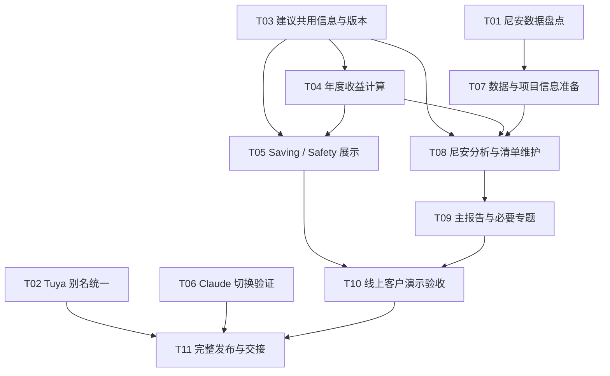
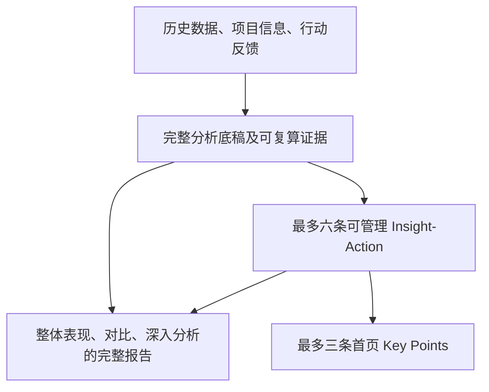

# 尼安客户演示：价值表达与交付任务图

## 目标与维护规则

用户已确认本轮需求。目标是为下一次尼安客户会议（当前目标日期 2026-09-21，以实际会议安排为准）准备可解释、可操作的建议和线上演示。成功标准是客户能判断建议是否值得执行，不以图表或报告数量衡量价值。

本文是本轮范围、DAG 和验收清单的维护源；[GitHub map issue #248](https://github.com/Zion74/energyiq-datafoundry/issues/248) 跟踪执行状态和证据，关联现有 #246（Key Points）、#245（行动反馈）、#247（Anthropic 接入），不重复声称已有功能已通过本轮验收。

每次推进更新任务状态、证据路径、阻塞原因和下一步。状态：待开始 / 进行中 / 待验收 / 完成 / 阻塞。实现、单测、真实模型、浏览器、生产部署与客户认可分别记录。当前仅需求和计划完成；以下功能尚未按本轮要求验收。不得把测试反馈写成真实行动。

## 已确认的产品决定

### 一份建议，三种阅读深度

复用现有 Insight/Action 领域对象，避免平行维护第二套建议。每个活跃 Insight 绑定一个主 Action；历史兼容另行审查。共同记录稳定 ID、设备 ID、显示名称、发现、证据窗口/来源、具体动作、收益情景、工作量/成本已知项、待确认问题、优先级与反馈状态。

- Key Points：短发现、一个行动、年度预计收益或安全意义，最多三条；不得为凑满三条编造内容。
- 行动详情：同一建议的完整依据、条件、模拟与反馈入口。
- Report：引用同一组已选建议及版本，图表解释其依据；生成时冻结版本，不随清单更新静默改写历史报告。保留模型组织 HTML 的自由。
- 分清“认可”“执行”“验证有效”。拒绝原因和现场回答必须供后续分析参考。

### 年度收益

年度金额作为主要决策表达，标签为 Estimated annual savings；实测短期数值作为证据，不能用 annual 口径夸大收益。

由 Agent 根据数据、设备和运营条件选择年化方法，并在沙盒中执行可复算的 Python/JS 脚本。系统不规定唯一业务公式、不自动把短期金额乘 365；只校验结果结构、范围、证据文件与候选结果的一致性，保存版本并用于展示。适用日型功率×时长×天数、可比日均节电量×次数等只是可选方法。选择依据、假设真实性仍需审阅，脚本存在不等于已证明它执行正确。

学校项目必须区分教学日、周末、公共假期及有依据的校假；未知日历不能硬套 365 天。记录参考年度、币种、税费口径、有效电价、样本数、覆盖、设备可控性、季节代表性及假设。安装/维护成本未知时不编造净收益或回本期；总表/子表与重叠措施不得重复计费。样本不足则不展示伪精确金额，明确需要补充的资料。年度估算与真实节省永不混淆。

### Saving / Safety

用户主要看到 Saving（绿色）和 Safety（浅红色）。内部可保留 investigation 等诊断状态，不强迫把证据不足的发现归成安全风险。

没有可信安全发现时，展示独立说明框：No supported safety concerns identified in the available data. 配合简短适用边界，不能表示检查合格或现场绝对安全。能耗异常不能自动等同漏电、火灾或设备故障。未知/不足的安全数据须与“已评估未发现”区分。

### Tuya 命名补充（用户直接确认）

| 原标识 | 用户显示别名 | 对应计量名称 |
|---|---|---|
| DB1 | Office Area | Office Area Power / Office Area Light |
| DB2 | Showroom Area | Showroom Area Power / Showroom Area Light |
| DB3 | LED | 保留 LED Display 1 / 2 / 3；实际总计名称按已发布结构核实 |

设备 ID、原始 API 名称和数据映射不变。仅在同一权威项目配置维护别名，Explorer、报告输入、Insight/Action 与图表共同读取。保留已有更具体的设备名称，不能把所有下级电表都改成区域总称。DB3 是 LED 分组，不据此推断新空间或电气拓扑。用户别名不构成对 PPT 原文重新核实的证明。

### 模型

Cloud 按用户已认可的任务整理解释为 Claude。先核查现有 Anthropic 实现和生产配置，再补缺口，不重复搭建。默认仍为 GPT；管理端 Models 可测试并切换 Claude，再切回 GPT。模型 ID、服务商及可用性以实际配置为准，不猜模型版本；密钥不入库文档、不回传浏览器。切换作用于新任务，运行中任务保持原版本与模型记录，现有权限不扩大。

### 尼安历史演示

先核实全部实际文件和数据库范围。用户提及 4–5 月、5–6 月、7–8 月，均为待核实线索，不是已确认覆盖。检查项目归属、时区、单位、累积/差值、重复与冲突、设备映射和时间缺口。静态 CSV 不表示支持实时更新。

分析使用全部有效历史；断档不补零，跨期比较必须控制可比条件。先产生候选 Insight/Action，再维护去重、排优先级、最多六个活跃槽位中选最多三个；报告使用完整分析底稿并突出同一选集；三条首页重点不限制正文的分析范围。先做一份主报告；有独立价值时再做专题/跨期报告。若当前执行链不能保证此顺序，需明确补齐与记录，不能仅靠提示词宣称硬性两阶段完成。

## 任务清单

| ID | 任务 / 产物 | 依赖 | 优先级 | 状态 | 验收标准 |
|---|---|---|---|---|---|
| T01 | 尼安文件与 DB 数据盘点表 | 无 | P0 | 完成 | 明确真实起止日期、文件来源、缺口、重复及可用电表；不猜月份 |
| T02 | Tuya 权威别名发布与名称一致性 | 无 | P1 | 已发布，待新报告回归 | hierarchy-v5 / template-v7；区域、Power/Light 和虚拟表别名已发布，ID、快照及政策不变；新报告措辞回归仍需补 |
| T03 | 建议共用信息与版本契约 | 无 | P0 | 进行中 | 三个页面共用引用、事实与收益；历史报告冻结；旧字段兼容 |
| T04 | 年度收益计算与审阅 | T03 | P0 | 进行中 | 公式、样本、日历、电价、假设可复算；不足时不输出误导金额；无重复收益 |
| T05 | Saving/Safety 首屏与详情 | T03,T04 | P0 | 首屏已实现，详情待完整验收 | Saving 绿色、Safety 暖红色；补齐无安全提示框及非现场检查边界；尚无真实安全案例验收 |
| T06 | Claude 生产模型切换 | 无；复用 #247 | P1 | 接入与切换完成 | 生产原生流式连接、隔离执行器真实工具回传通过；网页 GPT→Claude→GPT 已验收，最终 GPT 默认；完整 Claude 报告质量未验收 |
| T07 | 尼安数据/项目信息准备 | T01 | P0 | 演示完成 | 历史数据 2026-04-21 至 2026-08-20、学校日历分组已用于 v4 分析；不代表实时数据更新 |
| T08 | 尼安真实模型分析与清单维护 | T03,T04,T07 | P0 | 进行中 | 新发现有意义、1:1 主行动、去重与状态保护；年度收益合理；结构化输出通过校验 |
| T09 | 尼安主报告及必要专题 | T08 | P0 | 演示完成，待客户认可 | v4 已审阅、18 项独立数字检查通过并上线；含学校假期专题；没有据此声称客户价值已获认可 |
| T10 | 尼安网页发布与演示验收 | T05,T09 | P0 | 演示已发布 | 四项行动、三条首页重点、新报告已在线；原记录保护与重复登记通过；不是生产定时全自动链路的新验收 |
| T11 | 本轮完整发布与交接 | T02,T06,T10 | P1 | 进行中 | 发布记录见 2026-09-21-Ngee-customer-demo-release.md；保留 T03/T04/T08 与模型完整报告验收边界 |

没有当前子 Agent 分工。DAG 表示依赖关系，不等于已经并行启动任务。

## 任务 DAG

## 执行顺序与取舍

先 T01 查清尼安数据，再推进 T03/T04 和 T07；完成 T08 后将可信产物送入 T05/T09，最后 T10 走客户路径。T02/T06 可独立推进，但不是尼安使用 GPT 演示的硬依赖；不阻塞主线，也不能因此从本轮范围消失。暂不扩展手机排版或额外 BI 功能。

选择“先定义共用建议与收益口径，再生成演示产物”，而不是仅手工改一份 HTML。后者快但下次自动报告会复发，且不能保证三个页面一致。代价是需要契约兼容、事实校验和一次真实模型验收。

若尼安数据不足、设备不可识别或日历不可证实，缩小演示结论并披露限制，不填入假数据伪装真实效果。客户尚未执行行动，演示中只能展示条件情景；如需 mock，必须独立标识，不能写入真实效果记录。

## 演示检查清单

- [ ] 客户权限内能打开正确项目，首屏设备名能理解。
- [ ] 年度金额旁明确“预计”、适用条件和时间口径，详情能解释计算。
- [ ] Safety 状态不夸大检测能力，不凭用电异常诊断故障。
- [ ] Key Points、Action 和 Report 的建议/证据一致，能往返定位。
- [ ] 主报告可打开、图表可读、英文完整；静态数据日期清楚。
- [ ] GPT/Claude 切换验证与客户报告内容质量分别记录。
- [ ] 发布前备份，发布后检查，保留实际结果链接及待人工确认项。

## 相关记录

- [上一轮报告呈现及生产部署](../records/2026-09-20-Evidence-led-report-improvements.md)
- [周期报告真实模型验收](../records/2026-09-20-Periodic-real-model-acceptance.md)
- 客户反馈 Word：output/doc/charles-feedback-v1/EnergyIQ_Charles_Feedback.docx。此为反馈收集材料，不是客户已经认可的证据。

## 进度日志

- 2026-09-20：用户确认范围，补充 DB2=Showroom Area、DB3=LED；创建任务图与验收清单。未执行本轮数据改名、模型切换或生产数据变更。

- 2026-09-20 T01/T07：重新读取四份本地 Excel，100,223 个唯一原始读数键，3,455 重叠键、16 个冲突键。线上另有 Level 6/7 的 4 月 21 日至 8 月 20 日长批次；已发布快照 energy-snapshot-44c2750573915001fa0ca219 含 18 条序列、210,778 差值区间、20 个 cadence gap。日期覆盖以实际报告输入继续核实；不能将元数据 coverage 的 Z 后缀直接当作 Excel 时区事实。正式数据准备验收运行 b78df525-8de2-42fa-8e3a-af15e849c90c 已提交，仅聊天审计、不发布报告或行动。

- T01 完成：正式运行确认 4 月 21 日至 8 月 20 日已发布数据进入 Agent；[盘点证据及 T07 待复算边界](../records/2026-09-20-Ngee-Ann-data-readiness.md)。

- 2026-09-20：用户确认 Agent 主导方法与脚本计算，系统校验/保存。annualBenefit 可选结构接入候选清单和不可变发布版本；系统仅格式化年范围，不统一推算。保存脚本和结果文件、检查二者存在及 JSON 结果与候选一致，绝不在 API 主机运行 Agent 脚本。20 项相关测试及 API 构建通过。尚未部署；行动详情/报告数值一致性和真实模型执行复核仍待完成。尼安真实分析运行 7dfb4e38-33f2-4515-b96c-6f5902a60866 已提交，使用生产现有执行器加本轮提示进行研究验证，不发布报告和 Key Points。

- 正式报告 v2 已完成隔离生成、自动审阅、年度产物校验、临时数据库首次及重复登记。3 Insight / 3 Action / 3 Key Points，无重复新增。静态资产嵌入问题已由 Agent 修订；[验收记录](../records/2026-09-20-Ngee-Ann-formal-report-acceptance.md)。生产发布及网页点击链路仍未完成。

## 完整分析与简洁首页分离（用户复核后的修订）

问题：report-v2 只展开三个时段控制建议，数字经过验证，但不足以作为完整项目报告。保留 v2，不覆盖生成文件。当前验收目标改为：同一份历史数据先产生完整分析底稿，再交付完整报告及较小的行动清单。

底稿保存到 outputs/analysis-brief.md：每项适用分析包括范围、日期、单位、覆盖、事实、解释或假设、计算/图表数据路径、实际意义、限制和正文取舍理由。内容覆盖项目概况、非重叠贡献、时间变化、可比日型、事件筛查，以及存在真实执行反馈时的效果。缺少资料则记录不可分析的原因。六选三是行动管理限制，不是研究、图表或报告篇幅限制。描述性发现可以有价值，不强制登记行动。

修改范围：energy-report-investigation 0.7.0、report-presentation 1.6.0、report-review 0.5.0、report-skill-creator 1.4.0，以及完整报告服务提示。现有已绑定的数据库 Skill 版本不因此自动推广，生产生效需单独核实。专项行动反馈报告仍保持聚焦，不强加整项目章节。

验收步骤：
- [x] 保留 v2 原产物，建立独立 v3 输出目录。
- [x] 移除共享 Skill 中正文仅限 2–3 个问题的约束，加入底稿和覆盖审阅要求。
- [x] 启动同数据真实模型对照；只读项目输入、隔离产物，不登记生产清单。
- [x] 检查底稿实际计算、主要总量与非重叠口径，不能只验收文件存在。
- [x] 对照 v2/v3/v4：新增内容是否解释整体项目、是否有有效比较、是否支持判断，而不只增加字数。
- [x] 核对报告和结构化行动的名称、证据和收益一致。
- [ ] 完成后再评估推广，不能以自动审阅通过代替 Charles 认可。

完整分析 v4 通过自动审阅、独立关键数值复算和内存数据库重复登记。[结果及边界](../records/2026-09-20-Full-analysis-report-acceptance.md)。客户内容认可与生产推广保持待验收。

## 2026-09-21 学校假期分析补充

用户初步认可完整分析 v4，追加要求：学校项目同时比较公共假日/周末/平日，以及学校假期和正常教学期。复用现有发布校历，不把具体学期日期写死到通用 Skill；加入学校专项分析、24 小时曲线与样本/日型控制。[要求及复算](../records/2026-09-21-Ngee-Ann-school-calendar-analysis.md)。保留 v4，真实模型另生成新版本，生产推广仍待验收。

学校专项报告 v8 已完成真实模型修订、72 个小时点独立复算及重复登记验证，原 v4 保留。生产推广待验收。
